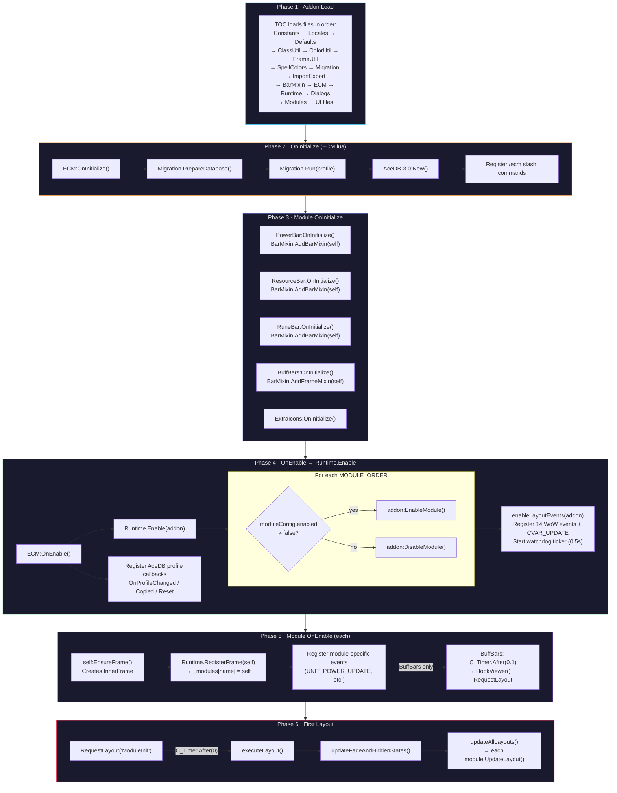

# ECM Architecture

EnhancedCooldownManager is an event-driven WoW addon built on AceAddon-3.0 / AceDB-3.0.
`Runtime.lua` is the central dispatcher: it registers WoW events, manages layout coalescing, and iterates modules. Each module (PowerBar, ResourceBar, RuneBar, BuffBars, ExtraIcons) inherits from `BarMixin` and implements its own `UpdateLayout()`.

## Initialization Chain

Six phases from TOC load through the first rendered frame.



## Event Flow & Layout Pipeline

WoW events funnel through `Runtime.lua` into one of three layout-request paths, all converging on `executeLayout()`.

```mermaid
flowchart TD
    subgraph EVENTS["WoW Event Sources"]
        WOW_MOUNT["PLAYER_MOUNT_DISPLAY_CHANGED<br/>UNIT_ENTERED/EXITED_VEHICLE"]
        WOW_COMBAT["PLAYER_REGEN_ENABLED (delay 0.1s)<br/>PLAYER_REGEN_DISABLED (immediate)"]
        WOW_ZONE["ZONE_CHANGED_* (delay 0.1s)<br/>PLAYER_ENTERING_WORLD (delay 0.4s)"]
        WOW_SPEC["PLAYER_SPECIALIZATION_CHANGED<br/>UPDATE_SHAPESHIFT_FORM"]
        WOW_TARGET["PLAYER_TARGET_CHANGED"]
        WOW_CVAR["CVAR_UPDATE"]
        WOW_REST["PLAYER_UPDATE_RESTING"]
    end

    subgraph MODULE_EVENTS["Module-Specific Events"]
        PB_PWR["UNIT_POWER_UPDATE<br/>→ PowerBar handler"]
        RB_AURA["UNIT_AURA / UNIT_POWER_UPDATE<br/>→ ResourceBar handler"]
        BB_ZONE["ZONE_CHANGED_* / PLAYER_ENTERING_WORLD<br/>→ BuffBars:OnZoneChanged"]
    end

    subgraph HOOKS["Frame Hooks (BuffBars)"]
        BB_SETPT["child:SetPoint hook<br/>→ restore anchors + restyle"]
        BB_SHOW["child:OnShow hook<br/>→ restyle"]
        BB_HIDE["child:OnHide hook"]
        BB_VIEWER["viewer:OnShow / OnSizeChanged"]
    end

    subgraph RUNTIME["Runtime.lua — Event Dispatch"]
        HANDLE["handleLayoutEvent(event)"]
        CVAR_HANDLE["CVAR_UPDATE handler<br/>(cooldownViewerEnabled only)"]

        subgraph LAYOUT_PATHS["Three Layout Request Paths"]
            direction LR
            REQ_LAY["RequestLayout(reason)<br/>Coalesce within frame<br/>C_Timer.After(0, exec)"]
            SCHED["ScheduleLayoutUpdate(delay)<br/>Debounced, cancels prior<br/>C_Timer.NewTimer(delay, exec)"]
            IMMED["UpdateLayoutImmediately()<br/>Synchronous execution<br/>(Edit Mode drag)"]
        end

        EXEC_LAY["executeLayout(reason)"]
    end

    subgraph EXECUTE["executeLayout — Common Endpoint"]
        HOOK_CVS["hookCooldownViewerSettings()<br/>(one-time)"]
        UPD_FADE["updateFadeAndHiddenStates()"]
        UPD_ALL["updateAllLayouts(reason)"]

        HOOK_CVS --> UPD_FADE --> UPD_ALL
    end

    subgraph FADE_LOGIC["updateFadeAndHiddenStates()"]
        EDIT_CHK{"Edit Mode<br/>or Preview?"}
        HIDE_CHK["Check: CVar off?<br/>Mounted? Resting OOC?"]
        ALPHA_CHK["Check fade config:<br/>OOC fade + exceptions<br/>(instance, hostile, friendly)"]
        SET_HIDDEN["setGloballyHidden(hidden)<br/>→ each module:SetHidden()"]
        SET_ALPHA["setAlpha(alpha)<br/>→ each module.InnerFrame"]
        ENFORCE["enforceBlizzardFrameState()<br/>→ show/hide/alpha Blizzard frames"]

        EDIT_CHK -->|yes| SET_HIDDEN
        EDIT_CHK -->|no| HIDE_CHK --> ALPHA_CHK --> SET_HIDDEN --> SET_ALPHA --> ENFORCE
    end

    subgraph UPDATE_ALL["updateAllLayouts(reason)"]
        INV_DET["invalidateDetachedAnchorMetrics()"]
        UPD_DET["updateDetachedAnchorLayout()"]
        CHAIN_LOOP["For each module in CHAIN_ORDER:<br/>PowerBar → ResourceBar → RuneBar<br/>→ BuffBars → ExtraIcons"]
        MOD_UPD["module:UpdateLayout(reason)"]

        INV_DET --> UPD_DET --> CHAIN_LOOP --> MOD_UPD
    end

    %% Event Sources → Runtime
    WOW_MOUNT & WOW_COMBAT & WOW_ZONE & WOW_SPEC & WOW_TARGET & WOW_REST --> HANDLE
    WOW_CVAR --> CVAR_HANDLE --> SCHED
    HANDLE -->|"delay > 0"| SCHED
    HANDLE -->|"delay = 0"| UPD_FADE

    %% Module events → RequestLayout
    PB_PWR & RB_AURA & BB_ZONE --> REQ_LAY

    %% Hooks → RequestLayout
    BB_SETPT & BB_SHOW & BB_HIDE & BB_VIEWER --> REQ_LAY

    %% All paths → executeLayout
    REQ_LAY --> EXEC_LAY
    SCHED --> EXEC_LAY
    IMMED --> EXEC_LAY

    EXEC_LAY --> EXECUTE
    UPD_FADE --> FADE_LOGIC
    UPD_ALL --> UPDATE_ALL

    style EVENTS fill:#1a1a2e,stroke:#4cc9f0,color:#e0e0e0
    style MODULE_EVENTS fill:#1a1a2e,stroke:#22c55e,color:#e0e0e0
    style HOOKS fill:#1a1a2e,stroke:#f7a855,color:#e0e0e0
    style RUNTIME fill:#16213e,stroke:#7a84f7,color:#e0e0e0
    style EXECUTE fill:#1a1a2e,stroke:#f43f5e,color:#e0e0e0
    style FADE_LOGIC fill:#1a1a2e,stroke:#a855f7,color:#e0e0e0
    style UPDATE_ALL fill:#1a1a2e,stroke:#22c55e,color:#e0e0e0
```



## Secondary Flows

### Profile Change

When a user switches, copies, or resets a profile, AceDB fires a callback → `ECM:OnProfileChangedHandler()` → re-runs migration → `Runtime.Enable()` re-enables/disables modules per new config → schedules a full layout with reason `"ProfileChanged"`. BuffBars clears its SpellColors cache on this reason.

### Edit Mode

LibEditMode detects WoW's Edit Mode enter/exit. On enter, all modules are forced visible (alpha 1, not hidden). Dragging or resizing calls `UpdateLayoutImmediately()` for instant feedback. On exit, normal fade/hidden rules re-apply.

### Options UI

Setting changes flow through LibSettingsBuilder's `onChange` → `Runtime.ScheduleLayoutUpdate(0, "OptionsChanged")`.

### Watchdog Ticker

A 0.5s `C_Timer.NewTicker` handles deferred Blizzard frame hooking (stops retrying once setup completes), enforces hidden/alpha state against Blizzard re-shows, and syncs module alpha.

```mermaid
flowchart TD
    subgraph PROFILE["Profile Change Flow"]
        USER_SWITCH["User switches/copies/resets profile"]
        ACE_CB["AceDB callback fires:<br/>OnProfileChanged / OnProfileCopied / OnProfileReset"]
        PROF_HANDLER["ECM:OnProfileChangedHandler()"]
        MIG["Migration.Run(new profile)"]
        RT_EN2["Runtime.Enable(addon)<br/>→ Re-enable/disable modules per new config"]
        SCHED_PC["ScheduleLayoutUpdate(0, 'ProfileChanged')"]
        BB_CLEAR["BuffBars:UpdateLayout('ProfileChanged')<br/>→ SpellColors.ClearDiscoveredKeys()"]

        USER_SWITCH --> ACE_CB --> PROF_HANDLER --> MIG --> RT_EN2 --> SCHED_PC --> BB_CLEAR
    end

    subgraph EDITMODE["Edit Mode Flow"]
        EM_ENTER["User enters WoW Edit Mode"]
        EM_DETECT["LibEditMode callback → 'enter'"]
        EM_LAYOUT["ScheduleLayoutUpdate(0, 'EditModeEnter')"]
        EM_FORCE["updateFadeAndHiddenStates()<br/>→ hidden=false, alpha=1 (always visible)"]

        EM_DRAG["User drags module frame"]
        EM_SAVE["onPositionChanged callback<br/>→ EditMode.SavePosition(config, ...)"]
        EM_IMMED["UpdateLayoutImmediately('EditModeDrag')"]

        EM_SLIDER["User adjusts width/height slider"]
        EM_WRITE["Direct config write: cfg.width = value"]
        EM_IMMED2["UpdateLayoutImmediately('EditModeWidth')"]

        EM_EXIT["User exits Edit Mode"]
        EM_EXIT_LAY["ScheduleLayoutUpdate(0, 'EditModeExit')<br/>→ Re-apply fade/hidden per config"]

        EM_ENTER --> EM_DETECT --> EM_LAYOUT --> EM_FORCE
        EM_DRAG --> EM_SAVE --> EM_IMMED
        EM_SLIDER --> EM_WRITE --> EM_IMMED2
        EM_EXIT --> EM_EXIT_LAY
    end

    subgraph OPTIONS["Options UI Flow"]
        OPT_CHANGE["User toggles setting in Options UI"]
        LSB_CB["LibSettingsBuilder onChange callback"]
        OPT_SCHED["Runtime.ScheduleLayoutUpdate(0, 'OptionsChanged')"]

        OPT_CHANGE --> LSB_CB --> OPT_SCHED
    end

    subgraph WATCHDOG["Watchdog Ticker (0.5s interval)"]
        WD_TICK["Every 0.5 seconds"]
        WD_SETUP{"Setup<br/>complete?"}
        WD_HOOK["hookBlizzardFrames()<br/>hookCooldownViewerSettings()"]
        WD_ENFORCE["enforceBlizzardFrameState()<br/>→ Correct Blizzard re-shows/alpha"]
        WD_ALPHA["Sync module alpha<br/>→ LazySetAlpha per module"]

        WD_TICK --> WD_SETUP
        WD_SETUP -->|no| WD_HOOK --> WD_ENFORCE
        WD_SETUP -->|yes| WD_ENFORCE --> WD_ALPHA
    end

    style PROFILE fill:#1a1a2e,stroke:#f7a855,color:#e0e0e0
    style EDITMODE fill:#1a1a2e,stroke:#7a84f7,color:#e0e0e0
    style OPTIONS fill:#1a1a2e,stroke:#22c55e,color:#e0e0e0
    style WATCHDOG fill:#1a1a2e,stroke:#f43f5e,color:#e0e0e0
```



## Event Reference

Runtime registers the shared layout events; modules register their own data-driven events in `OnEnable`. Events with multiple registrants are intentional — Runtime handles visibility/positioning while the module handles its own data refresh.

| Event | Registrant(s) | Purpose |
|-------|---------------|---------|
| CVAR_UPDATE | Runtime | Schedules layout when `cooldownViewerEnabled` changes |
| PLAYER_ENTERING_WORLD | Runtime, BuffBars, ExtraIcons | Runtime: full layout; BuffBars: refresh zone buffs; ExtraIcons: full refresh |
| PLAYER_MOUNT_DISPLAY_CHANGED | Runtime | Immediate layout for mounted-state visibility |
| PLAYER_REGEN_DISABLED | Runtime | Immediate layout; sets `_inCombat` flag |
| PLAYER_REGEN_ENABLED | Runtime | Delayed layout (combat-end delay); clears `_inCombat` |
| PLAYER_SPECIALIZATION_CHANGED | Runtime | Immediate layout for spec-dependent module visibility |
| PLAYER_TARGET_CHANGED | Runtime | Immediate layout for target-frame positioning |
| PLAYER_UPDATE_RESTING | Runtime | Immediate layout for resting-state visibility |
| UNIT_ENTERED_VEHICLE | Runtime | Immediate layout to hide bars in vehicle |
| UNIT_EXITED_VEHICLE | Runtime | Immediate layout to restore bars after vehicle |
| UPDATE_SHAPESHIFT_FORM | Runtime | Immediate layout for form/stance changes |
| VEHICLE_UPDATE | Runtime | Immediate layout for vehicle seat changes |
| ZONE_CHANGED | Runtime, BuffBars | Runtime: delayed layout; BuffBars: refresh zone-specific buffs |
| ZONE_CHANGED_INDOORS | Runtime, BuffBars | Runtime: delayed layout; BuffBars: refresh buff data |
| ZONE_CHANGED_NEW_AREA | Runtime, BuffBars | Runtime: delayed layout; BuffBars: refresh area-specific buffs |
| BAG_UPDATE_COOLDOWN | ExtraIcons | Throttled cooldown-state refresh |
| BAG_UPDATE_DELAYED | ExtraIcons | Layout update after bag contents finalize |
| PLAYER_EQUIPMENT_CHANGED | ExtraIcons | Refresh tracked equipment slot cooldowns on gear swap |
| SPELLS_CHANGED | ExtraIcons | Layout update when known spells change (talent/level) |
| SPELL_UPDATE_COOLDOWN | ExtraIcons | Throttled spell cooldown-state refresh |
| RUNE_POWER_UPDATE | RuneBar | Start rune animation ticker; request layout |
| UNIT_AURA | ResourceBar | Layout update when player auras change |
| UNIT_POWER_UPDATE | PowerBar, ResourceBar | PowerBar: primary power bar update; ResourceBar: resource tracking |

## Public Interfaces

### Runtime (`ns.Runtime`)

Central layout dispatcher. All layout requests funnel through here.

| Method | Description |
|--------|-------------|
| `Enable(addon)` | Start event dispatch and watchdog ticker |
| `Disable(addon)` | Stop event dispatch and cancel watchdog |
| `RequestLayout(reason?, opts?)` | Deferred layout pass (coalesces within frame via `C_Timer.After(0)`) |
| `ScheduleLayoutUpdate(delay, reason?)` | Debounced timer layout; later call with shorter delay supersedes |
| `UpdateLayoutImmediately(reason?)` | Synchronous layout (Edit Mode drag/resize) |
| `RequestRefresh(module, reason?)` | Values-only refresh for a single module |
| `RegisterFrame(frame)` | Register a module frame to receive layout updates |
| `UnregisterFrame(frame)` | Unregister a module frame |
| `SetLayoutPreview(active)` | Toggle layout preview mode (bypasses hide/fade) |
| `OnCombatEnd()` | Optional hook called when player exits combat |

### BarMixin (`ns.BarMixin`)

Two mixins applied in `OnInitialize`. `FrameProto` provides positioning, visibility, and Edit Mode support. `BarProto` extends it with StatusBar, ticks, text, and value refresh.

**Setup:**

| Method | Description |
|--------|-------------|
| `AddFrameMixin(target, name)` | Apply frame-only mixin (used by BuffBars, ExtraIcons) |
| `AddBarMixin(module, name)` | Apply bar mixin: frame + StatusBar + ticks (used by PowerBar, ResourceBar, RuneBar) |

**FrameProto (mixed into every module):**

| Method | Description |
|--------|-------------|
| `EnsureFrame()` | Create InnerFrame and register Edit Mode (call in `OnEnable`) |
| `CreateFrame()` | Build background, status bar, border, text layers |
| `UpdateLayout(why?)` | Full layout pass: position, dimensions, border, background |
| `Refresh(why?, force?)` | Base refresh (override for data updates) |
| `ThrottledRefresh(why?)` | Rate-limited refresh (skips if within `updateFrequency`) |
| `GetModuleConfig()` | Return this module's config from AceDB profile |
| `IsReady()` | Check enabled + has frame + has config |
| `SetHidden(hide)` | Set global hidden state; defers show to next layout |
| `ShouldShow()` | Evaluate whether frame should be visible |
| `GetNextChainAnchor(frameName?, anchorMode?)` | Return anchor frame and `isFirst` flag for chain/detached/free modes |
| `CalculateLayoutParams()` | Calculate layout params for current anchor mode |
| `ApplyFramePosition()` | Apply positioning from layout params |

**BarProto (mixed into PowerBar, ResourceBar, RuneBar):**

| Method | Description |
|--------|-------------|
| `Refresh(why?, force?)` | Update StatusBar value, text, texture, and dimensions |
| `GetStatusBarValues()` | Override to return `(current, max, displayValue, isFraction)` |
| `GetStatusBarColor()` | Override or use default class color |
| `EnsureTicks(count, parentFrame, poolKey?)` | Create/show/hide tick frames from pool |
| `HideAllTicks(poolKey?)` | Hide all ticks in pool |
| `LayoutResourceTicks(maxResources, color?, tickWidth?, poolKey?)` | Position ticks as resource dividers |
| `LayoutValueTicks(statusBar, ticks, maxValue, defaultColor, defaultWidth, poolKey?)` | Position ticks at specific values |

### ExtraIcons (`Modules/ExtraIcons.lua`)

Displays cooldown-tracked icons alongside Blizzard's cooldown viewer frames. Uses a dual-viewer architecture with a stack-aware resolver.

**Viewer Registry:** Maps abstract viewer keys to Blizzard frame globals. Current keys: `"utility"` → `UtilityCooldownViewer`, `"main"` → `EssentialCooldownViewer`. Each viewer has its own container frame, on-demand icon pool, and hook set. The main viewer's expanded footprint also drives a shared midpoint offset for the two-viewer layout; utility applies that pair offset first, then layers its own local centering so moving icons between viewers preserves the combined layout.

**Entry Kinds and Resolution:**

| Kind | Config Fields | Resolution | Cooldown Source |
|------|--------------|------------|-----------------|
| `equipSlot` | `slotId` | `GetInventoryItemID` + `C_Item.GetItemSpell` on-use check | `GetInventoryItemCooldown` |
| `item` | `ids[]` (priority stack) | First with `C_Item.GetItemCount > 0` | `C_Item.GetItemCooldown` |
| `spell` | `ids[]` (priority stack) | First with `IsPlayerSpell` → `C_Spell.GetSpellTexture` | `C_Spell.GetSpellCooldown` (pass-through, no inspection) |

Predefined stacks (`BUILTIN_STACKS`) are referenced by `stackKey` in config; the resolver reads `kind`/`ids`/`slotId` from the constant at runtime. Built-in entries may also persist `disabled = true`, which keeps them in the settings list but skips them during runtime resolution. Custom and racial entries store fields directly in saved config.

**Config Structure (`profile.extraIcons`):**

```lua
{
    enabled = true,
    viewers = {
        utility = {                      -- ordered array
            { stackKey = "trinket1" },   -- resolved from BUILTIN_STACKS
            { stackKey = "trinket2", disabled = true },
            { stackKey = "combatPotions" },
            { kind = "spell", ids = { 59752 } },  -- racial (self-contained)
        },
        main = {},
    },
}
```

**Settings UI (`UI/ExtraIconsOptions.lua`):** Uses `RegisterFromTable` for the enabled proxy setting and exposes only native controls plus the single viewer-management canvas. Data helpers (`_addStackKey`, `_removeEntry`, `_reorderEntry`, `_moveEntry`, `_toggleBuiltinRow`, etc.) are exposed on `ns.ExtraIconsOptions` for testability. Each viewer renders its ordered rows followed by an inline add row (`[type] [id] [resolved name] [add]`). Draft item IDs resolve asynchronously: pending item loads show `...`, request `GET_ITEM_INFO_RECEIVED`, and refresh the canvas as soon as Blizzard returns the item data so the resolved name and add button appear without extra typing. Duplicate entries are blocked across both viewers for add and move flows. Built-in rows use the trailing button as an enable/disable toggle instead of removal, and disabled built-ins are normalized to the bottom of their viewer in `BUILTIN_STACK_ORDER` so they stay visually stable. Missing built-ins are synthesized as disabled placeholders in the utility viewer so older profiles can still re-enable them without a separate quick-add section. The current-player racial is also synthesized as a disabled placeholder when absent; adding it writes a normal spell entry, and removing it returns the UI to that placeholder state. Racials from other races are filtered out of the settings list even if they remain in saved variables. Special-row behavior is explained through a short legend plus row-specific tooltips.

### FrameUtil (`ns.FrameUtil`)

Lazy setters avoid redundant frame API calls — they compare the new value against state and only call the Blizzard API when it changed.

| Method | Description |
|--------|-------------|
| `LazySetHeight(frame, h)` | Set height if changed |
| `LazySetWidth(frame, w)` | Set width if changed |
| `LazySetAlpha(frame, alpha)` | Set alpha if changed |
| `LazySetAnchors(frame, anchors)` | Clear and re-apply anchors if changed |
| `LazySetBackgroundColor(frame, color)` | Set background color if changed |
| `LazySetStatusBarTexture(bar, path)` | Set bar texture if changed |
| `LazySetStatusBarColor(bar, r, g, b, a)` | Set bar color if changed |
| `LazySetBorder(frame, borderConfig)` | Set border color/thickness if changed |
| `ApplyFont(fontString, globalConfig, moduleConfig)` | Apply font settings from config |
| `PixelSnap(value)` | Snap floating value to pixel boundary |
| `NormalizePosition(point, relativePoint, x, y, parent?)` | Convert offsets between anchor references |
| `ConvertOffsetToAnchor(src, target, x, y, w?, h?, parent?)` | Convert offsets accounting for frame dimensions |

### SpellColors (`ns.SpellColors`)

Multi-tier key system for per-spell color customization on buff bars. Keys match across spell name, spell ID, cooldown ID, and texture file ID.

| Method | Description |
|--------|-------------|
| `MakeKey(spellName?, spellID?, cooldownID?, textureFileID?)` | Create normalized spell-color key |
| `NormalizeKey(key)` | Normalize key payload into opaque key |
| `KeysMatch(left, right)` | Check if two keys identify the same spell |
| `MergeKeys(base, other)` | Merge identifiers from matching keys |
| `GetColorByKey(key)` | Get custom color for spell |
| `GetColorForBar(frame)` | Get custom color for a buff bar frame |
| `SetColorByKey(key, color)` | Set custom color for spell |
| `ResetColorByKey(key)` | Remove custom color entry |
| `GetAllColorEntries()` | Return deduplicated color entries for current class/spec |
| `GetDefaultColor()` | Return default color for class/spec |
| `SetDefaultColor(color)` | Set default color for class/spec |
| `ReconcileAllKeys(keys)` | Batch-reconcile keys (propagate most-recent across tiers) |
| `RemoveEntriesByKeys(keys)` | Remove matching persisted and discovered spell-color keys |
| `DiscoverBar(frame)` | Register a discovered bar key |
| `ClearDiscoveredKeys()` | Clear discovered key cache |
| `ClearCurrentSpecColors()` | Clear all colors for current class/spec |
| `SetConfigAccessor(accessor)` | Inject config accessor (decouples from AceDB) |

The spell-color settings canvas (`UI/BuffBarsOptions.lua`) merges persisted and discovered keys into one list, enables `Reconcile` and `Remove Stale` only when a row is still missing one or more identifiers, and lets `Remove Stale` confirmed-delete incomplete entries from both the current-spec stores and the runtime discovered-key cache while echoing each removal to chat.

### ClassUtil (`ns.ClassUtil`)

| Method | Description |
|--------|-------------|
| `GetResourceType(class, specIndex, shapeshiftForm)` | Return resource type enum for given spec |
| `GetPlayerResourceType()` | Return resource type for current player |
| `GetCurrentMaxResourceValues(resourceType)` | Return `(max, current, safeMax)` for resource type |

### ColorUtil (`ns.ColorUtil`)

| Method | Description |
|--------|-------------|
| `AreEqual(c1, c2)` | Compare two color tables for equality |
| `ColorToHex(color)` | Convert color to `"RRGGBB"` hex string |
| `Sparkle(text, startColor?, midColor?, endColor?)` | Apply 3-stop gradient to text |

### ImportExport (`ns.ImportExport`)

| Method | Description |
|--------|-------------|
| `ExportCurrentProfile()` | Export current profile; returns `(exportString, error)` |
| `ValidateImportString(importString)` | Validate without applying; returns `(data, error)` |
| `ApplyImportData(data)` | Apply validated data to current profile |
| `EncodeData(data)` | Low-level encode to compressed string |
| `DecodeData(importString)` | Low-level decode from compressed string |

### Migration (`ns.Migration`)

| Method | Description |
|--------|-------------|
| `Run(profile)` | Run all pending migrations on profile |
| `PrepareDatabase()` | Reseed versioned database slots |
| `Rollback(targetVersion)` | Roll back database to target version |
| `ValidateRollback(targetVersion)` | Validate rollback feasibility |
| `PrintInfo()` | Print schema version to chat |
| `GetLogText()` | Return migration log entries as string |
| `FlushLog()` | Clear migration log buffer |

### OptionUtil (`ns.OptionUtil`)

Shared helpers for the Settings UI, used by all option pages.

| Method | Description |
|--------|-------------|
| `GetNestedValue(tbl, path)` | Get value at dot-separated path |
| `SetNestedValue(tbl, path, value)` | Set value at dot-separated path, creating intermediates |
| `GetCurrentClassSpec()` | Return `(classID, specIndex, className, specName, classEnum)` |
| `GetIsDisabledDelegate(configPath)` | Return closure checking if module is disabled |
| `CreateModuleEnabledHandler(moduleName, requiresReload?)` | Create enable/disable toggle handler |
| `CreateBarArgs(isDisabled, options?)` | Generate standard bar layout/appearance args |
| `CreateDetachedStackArgs()` | Generate detached positioning args |
| `CreateDetachedAnchorEditModeSettings(getGlobalConfig, onChanged)` | Create Edit Mode settings for detached anchor |
| `OpenColorPicker(currentColor, hasOpacity, onChange)` | Open Blizzard color picker |
| `MakeConfirmDialog(text)` | Create confirm dialog for `StaticPopup` |
| `OpenLayoutPage()` | Open settings to Layout subcategory |

### ECM Addon Instance

Top-level namespace utilities and addon methods available globally.

| Method | Description |
|--------|-------------|
| `ns.GetGlobalConfig()` | Return global config section from database |
| `ns.IsDebugEnabled()` | Check if debug mode is enabled |
| `ns.IsDeathKnight()` | Check if player is a Death Knight |
| `ns.ToString(v)` | Convert value to safe string (handles taint) |
| `ns.CloneValue(value)` | Deep-clone a value |
| `ns.Log(module, message, data)` | Log to debug chat and DevTool |
| `mod:GetECMModule(name, silent?)` | Get ECM module by name |
| `mod:ConfirmReloadUI(text, onAccept?, onCancel?)` | Show confirm popup, reload on accept |
| `mod:ShowImportDialog()` | Show import string input dialog |
| `mod:ShowExportDialog(exportString)` | Show export string copy dialog |
| `mod:ShowCopyTextDialog(text, title?)` | Show small text-copy dialog |
| `mod:ShowMigrationLogDialog(text)` | Show scrollable migration log |
| `mod:ShowReleasePopup(force?)` | Show "What's New" popup |
