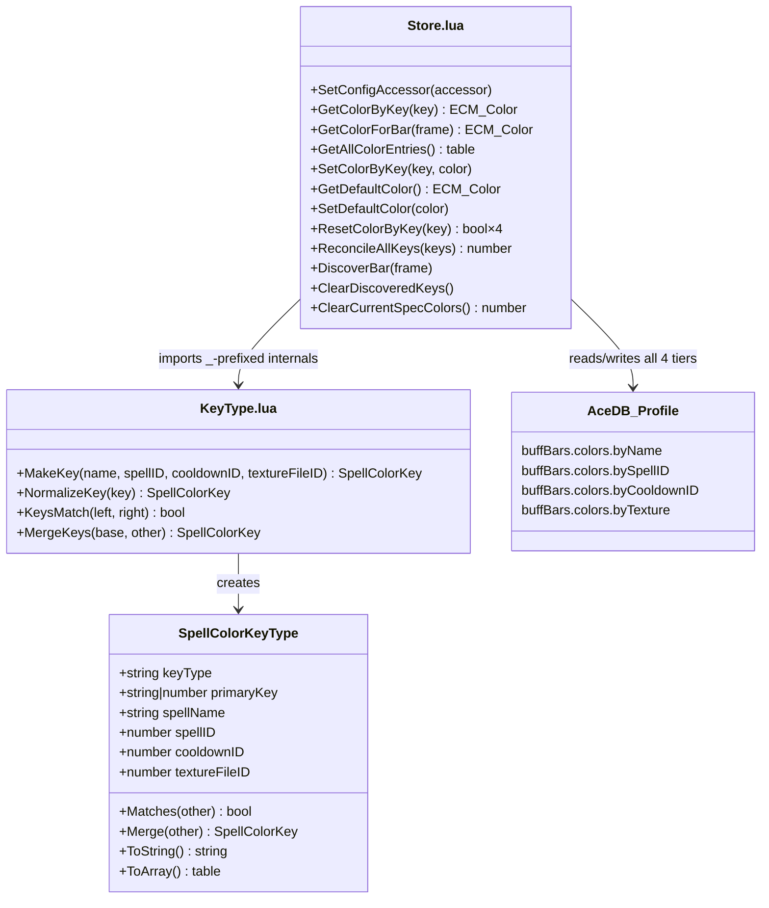
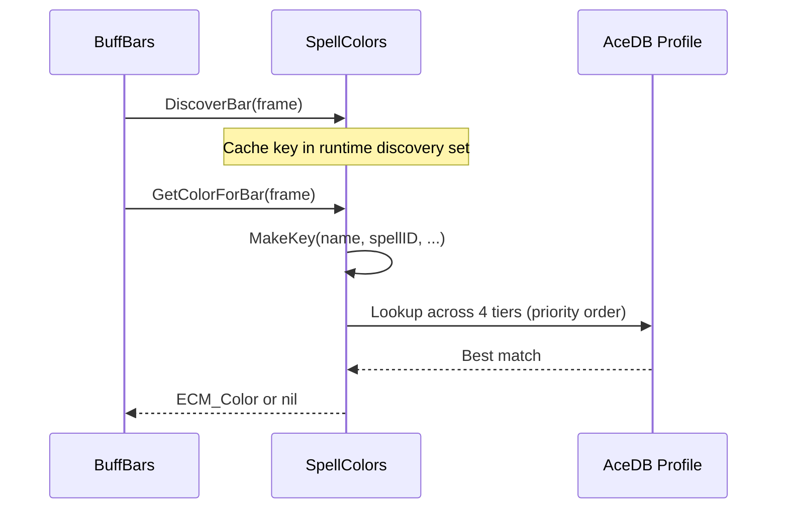

# SpellColors

Per-spell color customization for buff bars, backed by a multi-tier key system
with timestamp-based reconciliation across 4 key tiers.

## Architecture

## Key Tier Priority

| Tier | Store Key | Identifier | Priority |
|------|-----------|------------|----------|
| 1 | `byName` | Spell name (string) | Highest |
| 2 | `bySpellID` | Spell ID (number) | |
| 3 | `byCooldownID` | Cooldown ID (number) | |
| 4 | `byTexture` | Texture file ID (number) | Lowest |

## Data Flow

## Public API

### KeyType.lua (`ECM.SpellColors`)

| Function | Description |
|----------|-------------|
| `MakeKey(name, spellID, cooldownID, textureFileID)` | Creates a normalized key from identifying values |
| `NormalizeKey(key)` | Normalizes a raw key table into a `SpellColorKeyType` |
| `KeysMatch(left, right)` | Returns true if two keys identify the same entry |
| `MergeKeys(base, other)` | Merges identifiers from matching keys |

### Store.lua (`ECM.SpellColors`)

| Function | Description |
|----------|-------------|
| `SetConfigAccessor(fn)` | Injects a config accessor (decouples from `db.profile`) |
| `GetColorByKey(key)` | Gets custom color for a normalized key |
| `GetColorForBar(frame)` | Gets custom color for a bar frame |
| `GetAllColorEntries()` | Returns all color entries for current class/spec |
| `SetColorByKey(key, color)` | Sets a custom color by key |
| `GetDefaultColor()` | Returns the default bar color |
| `SetDefaultColor(color)` | Sets the default bar color |
| `ResetColorByKey(key)` | Removes custom color from all tiers |
| `ReconcileAllKeys(keys)` | Reconciles a list of keys and repairs metadata |
| `DiscoverBar(frame)` | Registers a bar in the runtime discovery cache |
| `ClearDiscoveredKeys()` | Wipes the discovery cache |
| `ClearCurrentSpecColors()` | Wipes all colors for the current class/spec |
