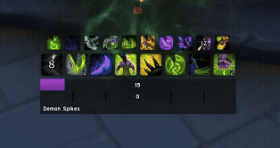
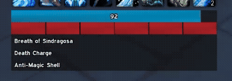
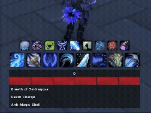
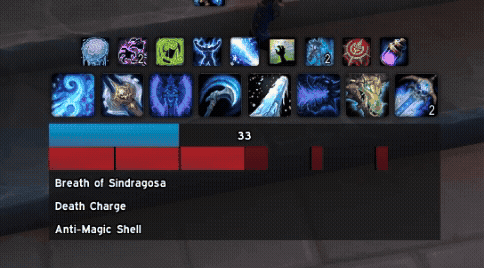

# Enhanced Cooldown Manager by Argium

Enhanced Cooldown Manager creates a clean combat HUD around Blizzard's built-in cooldown manager that **looks and works great out of the box** and is **straightforward to customise.**

Made with ❤️, with little features you didn't know you needed and won't want to live without.

##  Features

### ⚔️ Inline Resources

Adds essential combat bars directly below Blizzard's cooldown manager.

- `Power Bar` for mana, rage, energy, focus, and runic power
- `Resource Bar` for class resources
- `Rune Bar` for Death Knight rune tracking
- `Aura Bars` with unified style and color control

### 🎨 Aura Bars

Automatically position aura bars and style them to match. Change their colors for different spells so you can see their remaining duration at a glance.

### 🙈 Smart Visibility and Fade Rules

Reduce screen clutter automatically based on gameplay context:

- Hide while mounted or in a vehicle
- Hide in rest areas
- Fade when out of combat
- Optionally stay visible in instances (raids, M+, PVP)
- Optionally stay visible when you have an attackable target

### 🟥 Death Knight Runes

Track each rune independently as it recharges inline with other resources and cooldowns.

### 🧪 Add Icons for Trinkets, Potions, and Healthstones

Extend the utility cooldown bar with essential combat icons to save you a glance at the action bar.

- Equipped trinket cooldowns
- Health potion cooldown
- Combat potion cooldown
- Healthstone cooldown

### 📌 Automatic positioning or free movement

Use the layout mode that fits your setup.

- Auto-position directly under Blizzard's Cooldown Manager
- Detach modules and move them independently
- Mix and match layouts depending on preference

## Installation

1. Download and extract this addon into `World of Warcraft/_retail_/Interface/AddOns`.
2. Reload your UI or restart the game.

## Configuration

- Use `/ecm` in game to open options.
- You can also open it from the AddOn compartment menu near the minimap.

## Module support by class

Legend: 🟢 supported

| Class | Power Bar | Resource Bar |
| --- | --- | --- |
| Death Knight | 🟢 | 🟢 Runes |
| Demon Hunter | 🟢 | 🟢 Vengeance (Soul Fragments)  🟢 Devourer (Void Fragments) |
| Druid | 🟢 Balance/Restoration (Mana)  🟢 Feral (Energy)  🟢 Guardian (Rage) | 🟢 Feral (Combo Points) |
| Evoker | 🟢 Preservation (Mana) | 🟢 Essence |
| Hunter | 🟢 | |
| Mage | 🟢 | 🟢 Arcane (Charges), Frost (Icicles) |
| Monk | 🟢 Mistweaver (Mana)  🟢 Brewmaster (Energy) 🟢 Windwalker (Energy) | 🟢 Windwalker (Chi) |
| Paladin | 🟢 Holy (Mana) | 🟢 Holy Power|
| Priest | 🟢 | |
| Rogue | 🟢 | 🟢 Combo points|
| Shaman | 🟢 | 🟢 Enhancement (Maelstrom Weap.) |
| Warlock | 🟢 | 🟢 Soul shards |
| Warrior | 🟢 | |

## Troubleshooting

If you run into a problem, enable debug tracing with the command `/ecm debug on` and reload your UI. When the issue occurs again, type `/ecm bug`, copy the trace log and please include it when you open an issue.

## License

[GPL-3.0](LICENSE)
