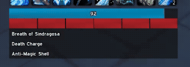
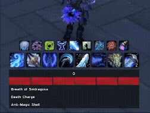
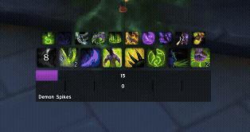

# Enhanced Cooldown Manager by Argium

ECM enriches the built-in Cooldown Manager with new features including power and resource bars, customisable-per-spell aura bars, and extra spell and item icons. It designed to be reminscent of the pre-Midnight WeakAura HUDs, and it **looks and works great out of the box** while being **straightforward to customise.** Each set of bars can be enabled or disabled, and detached and moved independently from others. Icons for health and combat potions are included by default and new ones can be added for racials, equipment, jumper cables - anything you want.

Made with ❤️.

###  Features

#### Power and Resources Bars

Adds bars for resources: mana, rage, energy, focus, fury, runic power
Or special class resources such as holy power, runes, and souls.

#### Aura Bars

Style the default aura bars to match power and resource bars.
Customise their colours **on a per-spell basis** to quickly idenify their remaining duration mid-combat.

#### Auto-hide and fade

Reduce screen clutter based based on context:

- Hide while mounted or in a vehicle
- Hide in rest areas
- Fade when out of combat
- Optionally stay visible in instances (raids, M+, PVP)
- Optionally stay visible when you have an attackable target

#### Add Icons for any Spell or Item

Add and icon to either the main or utility bars for **any** item or spell id: healthstones, potions, jumper cables, racials, anything!

### Automatic or free positioning

Use the layout mode that fits your setup:

- Auto-position directly under Blizzard's Cooldown Manager
- Detach modules and move them independently
- Mix and match layouts depending on preference

## Configuration

- Use `/ecm` in game to open options.
- You can also open it from the AddOn compartment menu near the minimap.

## License

[GPL-3.0](LICENSE)
