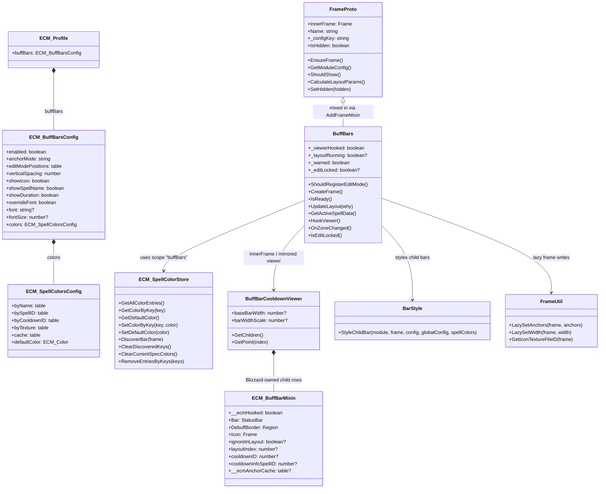

# BuffBars

## Overview

| Field | Details |
|---|---|
| **Module name** | `BuffBars` |
| **Description** | Mirrors Blizzard's `BuffBarCooldownViewer` area into ECM-styled aura bars. ECM repositions and restyles Blizzard-owned child bars instead of creating its own aura rows. |
| **Source file** | [`Modules/BuffBars.lua`](../Modules/BuffBars.lua) |
| **Mixin** | `BarMixin.AddFrameMixin(self, "BuffBars")` using `BarMixin.FrameProto` methods such as `EnsureFrame()`, `GetModuleConfig()`, `ShouldShow()`, and `CalculateLayoutParams()`. |
| **Events listened to** | - `ZONE_CHANGED_NEW_AREA` — refreshes zone-specific Blizzard aura bars and requests layout.<br/>- `ZONE_CHANGED` — refreshes zone changes that can alter the viewer's child set.<br/>- `ZONE_CHANGED_INDOORS` — refreshes indoor/outdoor aura transitions.<br/>- `PLAYER_ENTERING_WORLD` — catches initial world entry and reload/login transitions. |
| **Hooks** | - `BuffBarCooldownViewer:OnShow` — requests a layout pass when Blizzard re-shows the viewer.<br/>- `BuffBarCooldownViewer:OnSizeChanged` — requests a second-pass layout when Blizzard changes viewer width/size.<br/>- `child:SetPoint` — restores ECM's cached anchors, restyles the child, and queues a second-pass layout.<br/>- `child:OnShow` — reapplies ECM styling and queues a second-pass layout.<br/>- `child:OnHide` — queues a second-pass layout so the remaining bars restack cleanly. |
| **Dependencies** | - `ns.BarMixin` / `BarMixin.FrameProto` — frame-module lifecycle, config access, anchor calculation.<br/>- `ns.Runtime` — frame registration plus `RequestLayout()` / layout execution.<br/>- `ns.BarStyle.StyleChildBar` — applies ECM visuals to Blizzard child bars.<br/>- `ns.FrameUtil` — lazy anchors, width snapshots, icon texture lookup.<br/>- `ns.SpellColors.Get("buffBars")` — scoped spell-color discovery, lookup, and cache clearing.<br/>- `ns.Constants` / `ns.defaults` — scope name, anchor-mode semantics, default colors/config.<br/>- Blizzard `BuffBarCooldownViewer` and its child aura-bar frames — source viewer and mirrored rows.<br/>- `C_Timer.After(0.1)` — deferred hook install so the Blizzard viewer exists before BuffBars attaches hooks. |
| **Options file(s)** | [`UI/BuffBarsOptions.lua`](../UI/BuffBarsOptions.lua), plus BuffBars' section registration into [`UI/SpellColorsPage.lua`](../UI/SpellColorsPage.lua) |
| **Options dependencies** | - `ns.OptionUtil`<br/>- `LibSettingsBuilder`<br/>- `ns.SpellColors`<br/>- `ns.SpellColorsPage` |

## Actor flow

```mermaid
sequenceDiagram
    autonumber
    participant Game as Game (WoW client)
    participant ECM as ECM
    participant Runtime as Runtime
    participant BuffBars as BuffBars
    participant Viewer as BuffBarCooldownViewer
    participant Child as Blizzard aura child
    participant Colors as SpellColors store (buffBars)
    participant Options as Options UI
    participant EM as Edit Mode

    rect rgb(26,26,46)
    Note over Game,Colors: Startup / enable
    Game->>ECM: ADDON_LOADED / PLAYER_LOGIN
    ECM->>BuffBars: OnInitialize()
    BuffBars->>BuffBars: BarMixin.AddFrameMixin(self, "BuffBars")
    ECM->>Runtime: Runtime.Enable(addon)
    Runtime->>BuffBars: EnableModule("BuffBars")
    BuffBars->>Viewer: EnsureFrame() -> CreateFrame()
    BuffBars->>Runtime: RegisterFrame(self)
    BuffBars->>Game: RegisterEvent(ZONE_CHANGED_*, PLAYER_ENTERING_WORLD)
    BuffBars->>BuffBars: C_Timer.After(0.1)
    BuffBars->>BuffBars: HookViewer()
    BuffBars->>Runtime: RequestLayout("BuffBars:ModuleInit")
    end

    rect rgb(26,46,30)
    Note over Game,Colors: Registered BuffBars events
    Game->>BuffBars: ZONE_CHANGED_NEW_AREA
    BuffBars->>Runtime: RequestLayout("BuffBars:OnZoneChanged")
    Game->>BuffBars: ZONE_CHANGED
    BuffBars->>Runtime: RequestLayout("BuffBars:OnZoneChanged")
    Game->>BuffBars: ZONE_CHANGED_INDOORS
    BuffBars->>Runtime: RequestLayout("BuffBars:OnZoneChanged")
    Game->>BuffBars: PLAYER_ENTERING_WORLD
    BuffBars->>Runtime: RequestLayout("BuffBars:OnZoneChanged")
    end

    rect rgb(46,30,46)
    Note over Game,Colors: Viewer and child hooks
    Viewer-->>BuffBars: OnShow
    BuffBars->>Runtime: RequestLayout("BuffBars:viewer:OnShow")
    Viewer-->>BuffBars: OnSizeChanged
    BuffBars->>Runtime: RequestLayout("BuffBars:viewer:OnSizeChanged", { secondPass = true })
    Child-->>BuffBars: SetPoint
    BuffBars->>Child: LazySetAnchors(child.__ecmAnchorCache)
    BuffBars->>Child: StyleChildBar(...)
    BuffBars->>Runtime: RequestLayout("BuffBars:SetPoint:hook", { secondPass = true })
    Child-->>BuffBars: OnShow
    BuffBars->>Child: StyleChildBar(...)
    BuffBars->>Runtime: RequestLayout("BuffBars:OnShow:child", { secondPass = true })
    Child-->>BuffBars: OnHide
    BuffBars->>Runtime: RequestLayout("BuffBars:OnHide:child", { secondPass = true })
    end

    rect rgb(30,30,60)
    Note over Game,Colors: Layout and spell-color discovery
    Runtime->>BuffBars: UpdateLayout(reason)
    alt reason is PLAYER_SPECIALIZATION_CHANGED or ProfileChanged
        BuffBars->>Colors: ClearDiscoveredKeys()
    end
    BuffBars->>Viewer: GetChildren()
    loop each ordered visible child
        BuffBars->>Colors: DiscoverBar(child)
        BuffBars->>Child: Hook child once
        BuffBars->>Child: StyleChildBar(module, child, cfg, globalCfg, Colors)
    end
    alt module hidden
        BuffBars->>Viewer: Hide()
    else module shown
        BuffBars->>Viewer: LazySetAnchors(...) or LazySetWidth(...)
        BuffBars->>Child: layoutBars(...)
        BuffBars->>Viewer: Show()
    end
    end

    rect rgb(46,40,26)
    Note over Game,Colors: Profile and options changes
    ECM->>Runtime: ScheduleLayoutUpdate(0, "ProfileChanged")
    Runtime->>BuffBars: UpdateLayout("ProfileChanged")
    BuffBars->>Colors: ClearDiscoveredKeys()
    Options->>Runtime: ScheduleLayoutUpdate(0, "OptionsChanged")
    Runtime->>BuffBars: UpdateLayout("OptionsChanged")
    end

    rect rgb(26,40,46)
    Note over Game,Colors: Spell Colors page
    Options->>Colors: GetAllColorEntries() / GetDefaultColor()
    Options->>BuffBars: IsEditLocked()
    alt user changes a color
        Options->>Colors: SetColorByKey(...) / SetDefaultColor(...)
        Options->>Runtime: ScheduleLayoutUpdate(0, "OptionsChanged")
    else user resets or removes stale keys
        Options->>Colors: ClearCurrentSpecColors() / RemoveEntriesByKeys(...)
        Options->>Runtime: ScheduleLayoutUpdate(0, "OptionsChanged")
    end
    end

    rect rgb(46,26,30)
    Note over Game,Colors: Edit Mode
    EM->>Runtime: ScheduleLayoutUpdate(0, "EditModeEnter")
    Runtime->>BuffBars: UpdateLayout("EditModeEnter")
    Note over EM,BuffBars: BuffBars overrides ShouldRegisterEditMode() = false because registering the Blizzard viewer taints Blizzard Edit Mode selection.
    EM->>Runtime: UpdateLayoutImmediately("EditModeDrag")
    Runtime->>BuffBars: UpdateLayout("EditModeDrag")
    EM->>Runtime: ScheduleLayoutUpdate(0, "EditModeExit")
    end
```



## Component interactions

```mermaid
flowchart TD
    Runtime[Runtime.lua]
    BuffBars[BuffBars module]
    Viewer[BuffBarCooldownViewer]
    Child[Blizzard aura child frames]
    BarMixin[BarMixin.FrameProto]
    BarStyle[BarStyle.StyleChildBar]
    FrameUtil[FrameUtil]
    SpellStore[SpellColors store\nscope = "buffBars"]
    Options[BuffBarsOptions + SpellColorsPage]
    ECM[ECM.lua]

    subgraph Blizzard[Blizzard frames being mirrored]
        Viewer
        Child
    end

    subgraph Internals[ECM internals]
        ECM
        Runtime
        BuffBars
        BarMixin
        Options
    end

    subgraph Helpers[Shared helpers]
        BarStyle
        FrameUtil
        SpellStore
    end

    ECM -->|Runtime.Enable / profile callbacks| Runtime
    Runtime -->|EnableModule / RegisterFrame / UpdateLayout| BuffBars
    Runtime -->|shared layout events, edit-mode visibility, second pass| BuffBars
    BuffBars -->|CreateFrame / mirror viewer| Viewer
    Viewer -->|owns / creates| Child
    Viewer -->|OnShow / OnSizeChanged hooks| BuffBars
    Child -->|SetPoint / OnShow / OnHide hooks| BuffBars
    BuffBars -->|frame lifecycle + config lookup + layout params| BarMixin
    BuffBars -->|style each mirrored child| BarStyle
    BuffBars -->|lazy anchors, width, icon texture ids| FrameUtil
    BuffBars -->|Get("buffBars"), DiscoverBar, color lookup, cache clear| SpellStore
    Options -->|module settings rows| BuffBars
    Options -->|shared spell-color section| SpellStore
    Options -->|OptionsChanged -> schedule layout| Runtime

    style Blizzard fill:#1a1a2e,stroke:#4cc9f0,color:#e0e0e0
    style Internals fill:#1a1a2e,stroke:#22c55e,color:#e0e0e0
    style Helpers fill:#1a1a2e,stroke:#f7a855,color:#e0e0e0
```

## Data model



## Notes

- BuffBars does **not** pool or create its own child bars; it mirrors Blizzard-owned viewer children and re-applies ECM anchors/styles around them.
- `anchorMode = "free"` is special: Blizzard keeps owning the viewer's position, while ECM snapshots width and still restacks child rows.
- The shared Spell Colors page is shared with `ExternalBars`, but each module keeps a separate scoped store (`"buffBars"` vs. `"externalBars"`).
