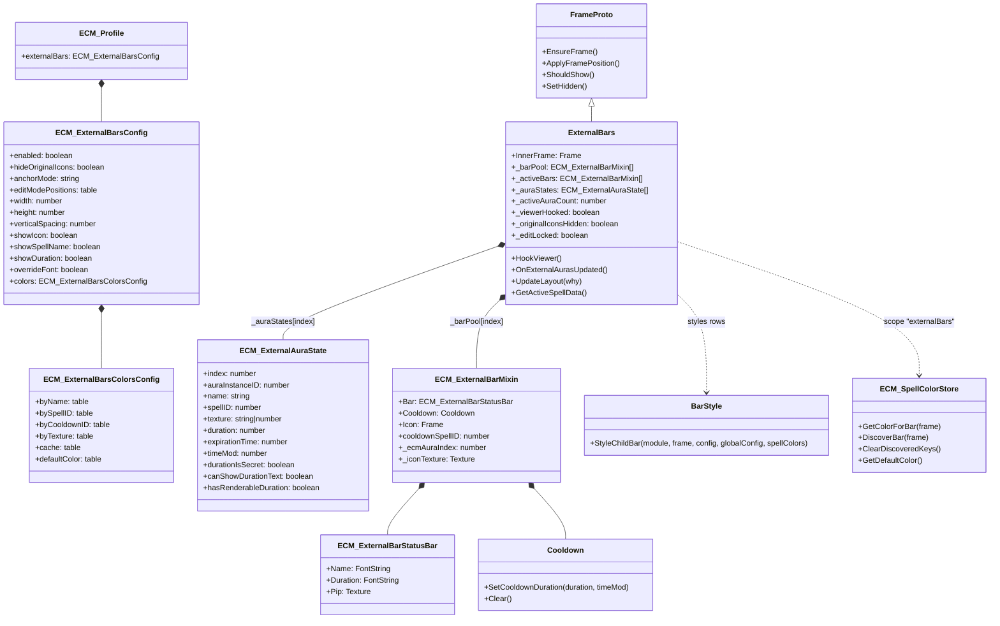

## ExternalBars

`ExternalBars` mirrors Blizzard's `ExternalDefensivesFrame` into ECM-owned bar rows. Unlike the aura-driven modules, it does not register its own aura events; Blizzard remains the authoritative source and ECM follows via hooks.

This module is intentionally absent from the `ARCHITECTURE.md` Event Reference table because its data flow is hook-driven, not event-driven.

## Summary

| Field | Value |
|---|---|
| **Module name** | `ExternalBars` |
| **Description** | Mirrors `ExternalDefensivesFrame` into ECM-styled bar rows. Hook-driven rather than event-driven: Blizzard populates `viewer.auraInfo`, and ECM copies that state into its own pooled rows. |
| **Source file** | [`Modules/ExternalBars.lua`](../Modules/ExternalBars.lua) |
| **Mixin** | `BarMixin.AddFrameMixin`; inherits [`FrameProto`](../BarMixin.lua) |
| **Events listened to** | None for aura data. `ExternalBars` does not call `RegisterEvent()` in `Modules/ExternalBars.lua`; aura refresh is driven by hooks on `ExternalDefensivesFrame:UpdateAuras()` plus the frame's `OnShow` / `OnHide`. `OnDisable()` still calls `UnregisterAllEvents()` as defensive cleanup. |
| **Hooks** | - Post-hook `ExternalDefensivesFrame:UpdateAuras()` → `OnExternalAurasUpdated()`<br>- `ExternalDefensivesFrame:HookScript("OnShow")` → refresh original-icon state, then resync aura state<br>- `ExternalDefensivesFrame:HookScript("OnHide")` → clear active rows, stop duration ticker, request layout<br>- `hideOriginalIcons` uses `ExternalDefensivesFrame:SetAlpha(0)` and `EnableMouse(false)` instead of `Hide()` so Blizzard keeps driving `UpdateAuras()` |
| **Dependencies** | - `ns.SpellColors.Get("externalBars")` scoped color store<br>- `BarStyle.StyleChildBar(...)` shared BuffBars / ExternalBars row styling<br>- `Cooldown` overlays via `SetCooldownDuration(duration, timeMod)` for draining fill<br>- `C_UnitAuras.GetAuraDataByAuraInstanceID("player", auraInstanceID)` for accessible aura metadata<br>- `FrameUtil` lazy setters and icon helpers<br>- `ns.Runtime.RequestLayout(...)` / runtime layout passes |
| **Options file(s)** | [`UI/ExternalBarsOptions.lua`](../UI/ExternalBarsOptions.lua), shared section registration in [`UI/SpellColorsPage.lua`](../UI/SpellColorsPage.lua) |
| **Options dependencies** | - `ns.OptionUtil` for disabled predicates, default-value transforms, module toggle handling, and layout breadcrumbs<br>- `LibSettingsBuilder` for the declarative Settings rows consumed by the root options tree<br>- `ns.SpellColors` for the scoped color store edited by the shared page<br>- `ns.SpellColorsPage` for `RegisterSection(...)` and the shared spell-colors editor |

## Actor diagram

```mermaid
sequenceDiagram
    autonumber
    participant Game as Game (WoW client)
    participant ACE as ACE / ECM
    participant Runtime as Runtime
    participant EB as ExternalBars
    participant Viewer as ExternalDefensivesFrame
    participant AuraAPI as C_UnitAuras
    participant Colors as SpellColors scope=externalBars
    participant UI as OptionsUI
    participant EditMode as LibEditMode

    rect rgb(26,26,46)
    note over Game,Colors: Startup / enable
    Game->>ACE: ADDON_LOADED / PLAYER_LOGIN
    ACE->>EB: OnInitialize()
    EB->>EB: BarMixin.AddFrameMixin(self, "ExternalBars")
    ACE->>EB: OnEnable()
    EB->>EB: EnsureFrame()
    EB->>Runtime: RegisterFrame(self)
    EB->>EB: Init _barPool / _activeBars / _auraStates
    EB->>EB: C_Timer.After(0.1)
    EB->>EB: HookViewer()
    EB->>Viewer: hooksecurefunc(UpdateAuras)
    EB->>Viewer: HookScript(OnShow / OnHide)
    EB->>EB: _RefreshOriginalIconsState()
    EB->>EB: OnExternalAurasUpdated()
    EB->>Runtime: RequestLayout("ExternalBars:OnEnable")
    end

    rect rgb(46,30,46)
    note over Viewer,Colors: Blizzard viewer pushes aura updates
    Viewer-->>EB: UpdateAuras() post-hook
    EB->>EB: OnExternalAurasUpdated()
    loop for each viewer.auraInfo[index]
        EB->>AuraAPI: GetAuraDataByAuraInstanceID("player", auraInstanceID)
        AuraAPI-->>EB: accessible aura metadata
        EB->>EB: copy into _auraStates[index]
    end
    EB->>Runtime: RequestLayout("ExternalBars:UpdateAuras")
    end

    rect rgb(30,30,60)
    note over Viewer,Runtime: Viewer visibility hooks
    Viewer-->>EB: OnShow
    EB->>EB: _RefreshOriginalIconsState()
    EB->>EB: OnExternalAurasUpdated()
    EB->>Runtime: RequestLayout("ExternalBars:UpdateAuras")
    Viewer-->>EB: OnHide
    EB->>EB: _activeAuraCount = 0; _hideExcessBars(0)
    EB->>EB: _StopDurationTicker()
    EB->>Runtime: RequestLayout("ExternalBars:viewer:OnHide")
    end

    rect rgb(26,46,30)
    note over Runtime,Colors: Runtime layout pulse
    Runtime->>EB: UpdateLayout(reason)
    EB->>EB: HookViewer(); _RefreshOriginalIconsState()
    alt reason == PLAYER_SPECIALIZATION_CHANGED or ProfileChanged
        EB->>Colors: ClearDiscoveredKeys()
    end
    loop for each active aura index
        EB->>EB: _ensureBar(index)
        EB->>EB: _ConfigureBar(bar, auraState, ...)
        EB->>Colors: DiscoverBar(bar)
    end
    EB->>EB: layoutBars(activeBars, InnerFrame, ...)
    EB->>EB: _RestartDurationTicker()
    end

    rect rgb(46,40,26)
    note over Game,Colors: Profile change
    Game->>ACE: switch / copy / reset profile
    ACE->>Runtime: Enable(addon) + ScheduleLayoutUpdate(0, "ProfileChanged")
    Runtime->>EB: UpdateLayout("ProfileChanged")
    EB->>Colors: ClearDiscoveredKeys()
    end

    rect rgb(46,26,30)
    note over UI,Runtime: Options change
    UI->>Runtime: ScheduleLayoutUpdate(0, "OptionsChanged")
    Runtime->>EB: UpdateLayout("OptionsChanged")
    end

    rect rgb(26,40,46)
    note over EditMode,Runtime: Edit Mode
    EditMode->>Runtime: ScheduleLayoutUpdate(0, "EditModeEnter")
    Runtime->>EB: UpdateLayout("EditModeEnter")
    EditMode->>Runtime: UpdateLayoutImmediately("EditModeDrag")
    Runtime->>EB: UpdateLayout("EditModeDrag")
    EditMode->>Runtime: ScheduleLayoutUpdate(0, "EditModeExit")
    Runtime->>EB: UpdateLayout("EditModeExit")
    end
```

## Component interaction diagram

```mermaid
flowchart TD
    subgraph BLIZZARD["Blizzard frames mirrored"]
        Viewer["ExternalDefensivesFrame\n(authoritative aura source)"]
        AuraInfo["viewer.auraInfo[]"]
        AuraAPI["C_UnitAuras\nGetAuraDataByAuraInstanceID"]
    end

    subgraph ECM["ECM internals"]
        ExternalBars["ExternalBars"]
        Runtime["Runtime"]
        Options["ExternalBarsOptions\n+ SpellColorsPage section"]
    end

    subgraph HELPERS["Shared helpers"]
        Cooldown["Cooldown overlays"]
        BarStyle["BarStyle.StyleChildBar"]
        FrameUtil["FrameUtil"]
        SpellColors["SpellColors store\nscope = \"externalBars\""]
    end

    Viewer -->|UpdateAuras post-hook| ExternalBars
    Viewer -->|OnShow / OnHide hooks| ExternalBars
    Viewer --> AuraInfo
    AuraInfo -->|copy by Blizzard array index| ExternalBars
    ExternalBars -->|metadata enrichment| AuraAPI
    Runtime -->|UpdateLayout(reason)| ExternalBars
    Options -->|OptionsChanged / shared spell-color UI| Runtime
    Options -->|edit scoped colors| SpellColors
    ExternalBars -->|RequestLayout(...)| Runtime
    ExternalBars -->|StyleChildBar(...)| BarStyle
    ExternalBars -->|LazySetWidth / Height / Anchors| FrameUtil
    ExternalBars -->|Get + DiscoverBar + ClearDiscoveredKeys| SpellColors
    ExternalBars -->|SetCooldownDuration / Clear| Cooldown
    BarStyle --> FrameUtil
    BarStyle --> SpellColors

    style BLIZZARD fill:#1a1a2e,stroke:#4cc9f0,color:#e0e0e0
    style ECM fill:#16213e,stroke:#22c55e,color:#e0e0e0
    style HELPERS fill:#1a1a2e,stroke:#f7a855,color:#e0e0e0
```

## Data model class diagram



## Notes

- `_auraStates[]` is keyed by Blizzard's `viewer.auraInfo` array index, not by `auraInstanceID`. `auraInstanceID` is preserved only for Blizzard aura API lookups.
- `hideOriginalIcons` is deliberately implemented as alpha and mouse suppression, not `Hide()`, so Blizzard continues to execute `ExternalDefensivesFrame:UpdateAuras()`.
- `UpdateLayout("PLAYER_SPECIALIZATION_CHANGED")` and `UpdateLayout("ProfileChanged")` both clear discovered spell-color keys for the `externalBars` scope before restyling rows.
- Duration fill and duration text are separate paths: the `Cooldown` widget can render secret durations, while Lua text refresh only runs when expiration data is safe to inspect directly.
