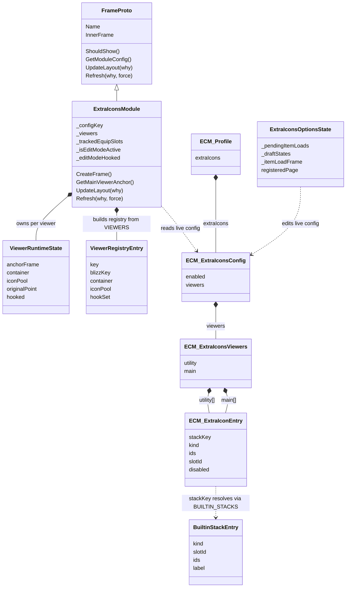

# ExtraIcons

## Summary

| Field | Details |
|---|---|
| **Module name** | `ExtraIcons` |
| **Description** | Displays extra cooldown-tracked icons beside Blizzard's cooldown viewers. It uses a dual-viewer architecture (`utility` and `main`) so icons can either extend the essential viewer footprint or live beside the utility viewer independently. |
| **Source file** | [`Modules/ExtraIcons.lua`](../Modules/ExtraIcons.lua) |
| **Mixin** | `BarMixin.AddFrameMixin`; inherits [`BarMixin.FrameProto`](../BarMixin.lua) |
| **Events listened to** | <ul><li>`BAG_UPDATE_COOLDOWN` — throttled icon cooldown refresh for item/spell state changes.</li><li>`BAG_UPDATE_DELAYED` — request a fresh layout after bag contents settle.</li><li>`PLAYER_EQUIPMENT_CHANGED` — re-evaluate tracked equip-slot entries (notably trinkets) and request layout when a referenced slot changed.</li><li>`PLAYER_ENTERING_WORLD` — request a full layout refresh after world entry.</li><li>`SPELLS_CHANGED` — request layout when known spells change.</li><li>`SPELL_UPDATE_COOLDOWN` — throttled spell cooldown refresh.</li><li>`UtilityCooldownViewer` / `EssentialCooldownViewer` `OnShow` — request layout when a Blizzard viewer becomes visible.</li><li>`UtilityCooldownViewer` / `EssentialCooldownViewer` `OnHide` — hide extra-icon containers/anchors and request layout.</li><li>`UtilityCooldownViewer` / `EssentialCooldownViewer` `OnSizeChanged` — request layout when Blizzard viewer width changes.</li><li>`EditModeManagerFrame` `OnShow` / `OnHide` — enter/exit edit-mode layout behavior.</li><li>`GET_ITEM_INFO_RECEIVED` — options-page async draft-item resolution refresh.</li><li>`PLAYER_EQUIPMENT_CHANGED` (options item-load frame) — refresh built-in equip-slot rows when tracked gear changes.</li></ul> |
| **Layout ordering** | `ExtraIcons:UpdateLayout()` runs first inside `Runtime.updateAllLayouts()`, so the main viewer anchor reflects Blizzard icons plus appended extra icons before chained bars compute their own positions. |
| **Dependencies** | <ul><li>`ns.BarMixin` / `BarMixin.FrameProto` — frame lifecycle, visibility, config access.</li><li>`ns.Runtime` — registration, layout requests, preview state.</li><li>`ns.Constants.BUILTIN_STACKS` — built-in stack definitions resolved by `stackKey`.</li><li>`ns.Constants.BUILTIN_STACK_ORDER` — canonical built-in row ordering: `trinket1`, `trinket2`, `combatPotions`, `healthPotions`, `healthstones`.</li><li>`ns.Constants.RACIAL_ABILITIES` — current-race racial placeholder synthesis in the options UI.</li><li>`ns.FrameUtil` — inherited lazy layout helpers through `FrameProto` / runtime-owned layout code.</li><li>`ns.OptionUtil` and `ns.ExtraIconsOptions` — settings UI actions, confirmation flow, section-list wiring.</li><li>`ns.Addon.db.profile.extraIcons` — persisted config source of truth.</li></ul> |
| **Blizzard APIs used** | <ul><li>`UtilityCooldownViewer`, `EssentialCooldownViewer` — Blizzard viewer frames being extended and re-anchored.</li><li>`GetInventoryItemID`, `GetInventoryItemCooldown`, `GetInventoryItemTexture` — equip-slot resolution and cooldown display.</li><li>`C_Item.GetItemSpell`, `C_Item.GetItemCount`, `C_Item.GetItemCooldown` — item usability / cooldown resolution.</li><li>`C_Item.GetItemIconByID`, `C_Item.GetItemNameByID`, `C_Item.DoesItemExistByID`, `C_Item.RequestLoadItemDataByID` — options-page item preview and async item-load flow.</li><li>`C_SpellBook.IsSpellKnown` — spell resolver gate.</li><li>`C_Spell.GetSpellTexture`, `C_Spell.GetSpellCooldown` — spell icon and cooldown lookup (`GetSpellCooldown` stays pass-through / secret-value safe).</li><li>`C_Spell.GetSpellCharges`, `C_Spell.GetSpellChargeDuration`, `C_Spell.GetSpellCooldownDuration` — charge-aware cooldown rendering.</li><li>`UnitRace` — current-player racial placeholder resolution.</li></ul> |
| **Options file(s)** | [`UI/ExtraIconsOptions.lua`](../UI/ExtraIconsOptions.lua) |
| **Options dependencies** | <ul><li>`ns.OptionUtil` — enable/disable helpers and confirmation dialog plumbing.</li><li>`LibSettingsBuilder` section-list row (`type = "sectionList"`) — viewer collections and inline add rows.</li><li>Async item-info flow backed by `GET_ITEM_INFO_RECEIVED` and `C_Item.RequestLoadItemDataByID`.</li></ul> |

## Architecture Notes

### ExtraIcons (`Modules/ExtraIcons.lua`)

Displays cooldown-tracked icons alongside Blizzard's cooldown viewer frames. Uses a dual-viewer architecture with a stack-aware resolver.

**Viewer Registry:** Maps abstract viewer keys to Blizzard frame globals. Current keys: `"utility"` → `UtilityCooldownViewer`, `"main"` → `EssentialCooldownViewer`. Each viewer has its own container frame, on-demand icon pool, and hook set. The main viewer's expanded footprint also drives a shared midpoint offset for the two-viewer layout; utility applies that pair offset first, then layers its own local centering so moving icons between viewers preserves the combined layout.

**Entry Kinds and Resolution:**

| Kind | Config Fields | Resolution | Cooldown Source |
|------|--------------|------------|-----------------|
| `equipSlot` | `slotId` | `GetInventoryItemID` + `C_Item.GetItemSpell` on-use check | `GetInventoryItemCooldown` |
| `item` | `ids[]` (priority stack) | First with `C_Item.GetItemCount > 0` | `C_Item.GetItemCooldown` |
| `spell` | `ids[]` (priority stack) | First known via `C_SpellBook.IsSpellKnown`, then `C_Spell.GetSpellTexture` | `C_Spell.GetSpellCooldown` (pass-through, no inspection) |

Predefined stacks (`BUILTIN_STACKS`) are referenced by `stackKey` in config; the resolver reads `kind`/`ids`/`slotId` from the constant at runtime. Built-in entries may also persist `disabled = true`, which keeps them in the settings list but skips them during runtime resolution. Custom and racial entries store fields directly in saved config.

**Config Structure (`profile.extraIcons`):**

```lua
{
    enabled = true,
    viewers = {
        utility = {                      -- ordered array
            { stackKey = "trinket1" },   -- resolved from BUILTIN_STACKS
            { stackKey = "trinket2", disabled = true },
            { stackKey = "combatPotions" },
            { kind = "spell", ids = { 59752 } },  -- racial (self-contained)
        },
        main = {},
    },
}
```

**Settings UI (`UI/ExtraIconsOptions.lua`):**

Registers through the root/section/page API and exposes only native controls plus the single viewer-management section list. Data helpers (`_addStackKey`, `_removeEntry`, `_reorderEntry`, `_moveEntry`, `_toggleBuiltinRow`, etc.) and page setup hooks (`SetRegisteredPage`, `EnsureItemLoadFrame`, `BuildSections`, `ResetToDefaults`) are exposed on `ns.ExtraIconsOptions` for testability and options bootstrap.

*Row rendering and add flow.* Each viewer renders its ordered rows followed by an inline add row (`[type] [id] [resolved name] [add]`). Draft item IDs resolve asynchronously: pending item loads show `...`, request `GET_ITEM_INFO_RECEIVED`, and refresh the page as soon as Blizzard returns the item data so the resolved name and add button appear without extra typing. Duplicate entries are blocked across both viewers for add and move flows.

*Built-in rows.* Built-in rows use the trailing button as an enable/disable toggle instead of removal, and disabled built-ins are normalized to the bottom of their viewer in `BUILTIN_STACK_ORDER` so they stay visually stable. Missing built-ins are synthesized as disabled placeholders in the utility viewer so older profiles can still re-enable them without a separate quick-add section.

*Trinket and equip-slot filtering.* Trinket built-ins are only rendered when the currently equipped slot resolves to an on-use spell, so passive trinkets stay in saved variables but disappear from the table until they become usable again. Equip-slot placeholders follow the same on-use filter, and trinket-slot equipment changes refresh the page so the visible rows stay in sync.

*Racials.* The current-player racial is synthesized as a disabled placeholder in the utility viewer when absent; racial lookup uses only the `UnitRace("player")` race file token, with no normalization, spellbook, or localized-name fallback. Adding it writes a normal spell entry, and removing it returns the UI to that placeholder state. Racials from other races are filtered out of the settings list even if they remain in saved variables.

*Lifecycle.* Special-row behavior is explained through a short legend plus row-specific tooltips. Section-list rows stay on the current lifecycle path so viewer switches do not lose or misplace embedded content.

## Actor Diagram

```mermaid
sequenceDiagram
    autonumber
    actor User
    participant ECM as ECM / AceAddon
    participant Runtime as ns.Runtime
    participant Extra as ExtraIcons
    participant FrameProto as BarMixin.FrameProto
    participant Blizz as Blizzard viewers
    participant Options as UI/ExtraIconsOptions.lua
    participant ItemFlow as Item-load frame
    participant EditMode as EditModeManagerFrame

    rect rgb(26,26,46)
        ECM->>Extra: OnInitialize()
        Extra->>FrameProto: AddFrameMixin(self, "ExtraIcons")
        ECM->>Extra: OnEnable()
        Extra->>Extra: EnsureFrame() + CreateFrame()
        Extra->>Runtime: RegisterFrame(self)
        Extra->>Extra: _rebuildTrackedSlots()
        Extra->>Extra: Register BAG_UPDATE_*, PLAYER_*, SPELL_* events
        Extra->>EditMode: Hook OnShow / OnHide after C_Timer.After(0.1)
        Extra->>Blizz: Hook OnShow / OnHide / OnSizeChanged
        Extra->>Runtime: RequestLayout("ExtraIcons:OnEnable")
    end

    rect rgb(26,46,30)
        Blizz-->>Extra: OnShow
        Extra->>Runtime: RequestLayout("ExtraIcons:OnShow")
        Blizz-->>Extra: OnHide
        Extra->>Extra: Hide viewer container + anchor
        Extra->>Runtime: RequestLayout("ExtraIcons:OnHide")
        Blizz-->>Extra: OnSizeChanged
        Extra->>Runtime: RequestLayout("ExtraIcons:OnSizeChanged")
        Note over Runtime,Extra: updateAllLayouts() calls ExtraIcons:UpdateLayout() first so GetMainViewerAnchor() already reflects the final main-viewer width before chained bars lay out.
    end

    rect rgb(46,30,46)
        User->>Options: Add / remove / move / toggle entry
        Options->>Options: Mutate profile.extraIcons.viewers
        Options->>Runtime: ScheduleLayoutUpdate(0, "OptionsChanged")
        Options->>Options: registeredPage:Refresh()
        User->>Options: Type draft item ID
        Options->>ItemFlow: C_Item.RequestLoadItemDataByID(itemId)
        ItemFlow-->>Options: GET_ITEM_INFO_RECEIVED(itemId)
        Options->>Options: Clear _pendingItemLoads[itemId]
        Options->>Options: Refresh page to reveal resolved name / add button
    end

    rect rgb(30,30,60)
        User->>Options: Open / close Extra Icons page
        Options->>Runtime: SetLayoutPreview(true / false)
        Options->>ItemFlow: Ensure item-load frame
        EditMode-->>Extra: OnShow
        Extra->>Extra: Set _isEditModeActive = true and hide containers
        Extra->>Runtime: RequestLayout("ExtraIcons:EnterEditMode")
        EditMode-->>Extra: OnHide
        Extra->>Extra: Set _isEditModeActive = false
        Extra->>Runtime: RequestLayout("ExtraIcons:ExitEditMode")
    end

    rect rgb(46,40,26)
        Blizz-->>Extra: BAG_UPDATE_COOLDOWN
        Extra->>Extra: ThrottledRefresh("OnBagUpdateCooldown")
        Blizz-->>Extra: BAG_UPDATE_DELAYED
        Extra->>Runtime: RequestLayout("ExtraIcons:OnBagUpdateDelayed")
        Blizz-->>Extra: SPELL_UPDATE_COOLDOWN
        Extra->>Extra: ThrottledRefresh("OnSpellUpdateCooldown")
        Blizz-->>Extra: SPELLS_CHANGED
        Extra->>Runtime: RequestLayout("ExtraIcons:OnSpellsChanged")
        Blizz-->>Extra: PLAYER_ENTERING_WORLD
        Extra->>Runtime: RequestLayout("ExtraIcons:OnPlayerEnteringWorld")
    end

    rect rgb(46,26,30)
        Blizz-->>Extra: PLAYER_EQUIPMENT_CHANGED(slotId)
        Extra->>Extra: Check _trackedEquipSlots[slotId]
        Extra->>Runtime: RequestLayout("ExtraIcons:OnPlayerEquipmentChanged")
        Blizz-->>ItemFlow: PLAYER_EQUIPMENT_CHANGED(slotId)
        ItemFlow->>Options: Refresh built-in equip-slot rows / trinket placeholders
    end

    rect rgb(26,40,46)
        ECM->>ECM: OnProfileChangedHandler()
        ECM->>Runtime: Enable(self)
        ECM->>Runtime: ScheduleLayoutUpdate(0, "ProfileChanged")
    end
```



## Component Interaction Diagram

```mermaid
flowchart TD
    subgraph BLIZZ["Blizzard viewer frames"]
        UV["UtilityCooldownViewer"]
        MV["EssentialCooldownViewer"]
    end

    subgraph RESOLVE["Resolver inputs"]
        GIID["GetInventoryItemID"]
        GIICD["GetInventoryItemCooldown"]
        GIT["GetInventoryItemTexture"]
        CITEM["C_Item.*<br/>spell / count / cooldown / icon / name / request load"]
        CSPELL["C_Spell.*<br/>texture / cooldown / charges"]
        CSPELLBOOK["C_SpellBook.IsSpellKnown"]
        URACE["UnitRace"]
    end

    subgraph ECMI["ECM internals"]
        RT["Runtime.lua<br/>register + request + first-in-chain layout"]
        BM["BarMixin.FrameProto"]
        FU["FrameUtil.lua"]
        CONST["Constants.lua<br/>BUILTIN_STACKS / BUILTIN_STACK_ORDER / RACIAL_ABILITIES"]
        DEF["Defaults.lua<br/>profile.extraIcons"]
    end

    subgraph UI["Settings UI"]
        OPT["UI/ExtraIconsOptions.lua"]
        OPTAPI["ns.ExtraIconsOptions helpers<br/>_addStackKey / _removeEntry / _moveEntry / _toggleBuiltinRow / BuildSections"]
        ITEMLOAD["item-load frame<br/>GET_ITEM_INFO_RECEIVED + tracked PLAYER_EQUIPMENT_CHANGED"]
    end

    EXTRA["Modules/ExtraIcons.lua<br/>viewer registry + resolver + icon pools"]

    BM -->|inherits lifecycle/config helpers| EXTRA
    RT -->|RegisterFrame / RequestLayout / ScheduleLayoutUpdate| EXTRA
    FU -.->|shared lazy layout helpers via runtime + FrameProto| EXTRA
    CONST -->|stack / racial / viewer constants| EXTRA
    DEF -->|default profile.extraIcons shape| EXTRA

    UV -->|hook + append utility icons| EXTRA
    MV -->|hook + extend main anchor footprint| EXTRA
    EXTRA -->|repositions / sizes| UV
    EXTRA -->|repositions / sizes| MV

    GIID -->|equip-slot item lookup| EXTRA
    GIICD -->|slot cooldowns| EXTRA
    GIT -->|slot textures| EXTRA
    CITEM -->|item stacks, cooldowns, icons, async names| EXTRA
    CSPELLBOOK -->|known-spell filter| EXTRA
    CSPELL -->|spell textures + cooldowns| EXTRA
    URACE -->|current-player racial id| OPT

    OPT -->|edits profile.extraIcons.viewers| EXTRA
    OPT -->|exports helpers on| OPTAPI
    OPT -->|ensures / refreshes| ITEMLOAD
    ITEMLOAD -->|refresh page when item data or trinkets change| OPT
    OPT -->|ScheduleLayoutUpdate("OptionsChanged")| RT
    OPT -->|SetLayoutPreview(true/false)| RT

    style BLIZZ fill:#1a1a2e,stroke:#4cc9f0,color:#e0e0e0
    style RESOLVE fill:#1a1a2e,stroke:#22c55e,color:#e0e0e0
    style ECMI fill:#1a1a2e,stroke:#a855f7,color:#e0e0e0
    style UI fill:#1a1a2e,stroke:#f7a855,color:#e0e0e0
    style EXTRA fill:#16213e,stroke:#f43f5e,color:#e0e0e0
```

## Data Model Class Diagram


