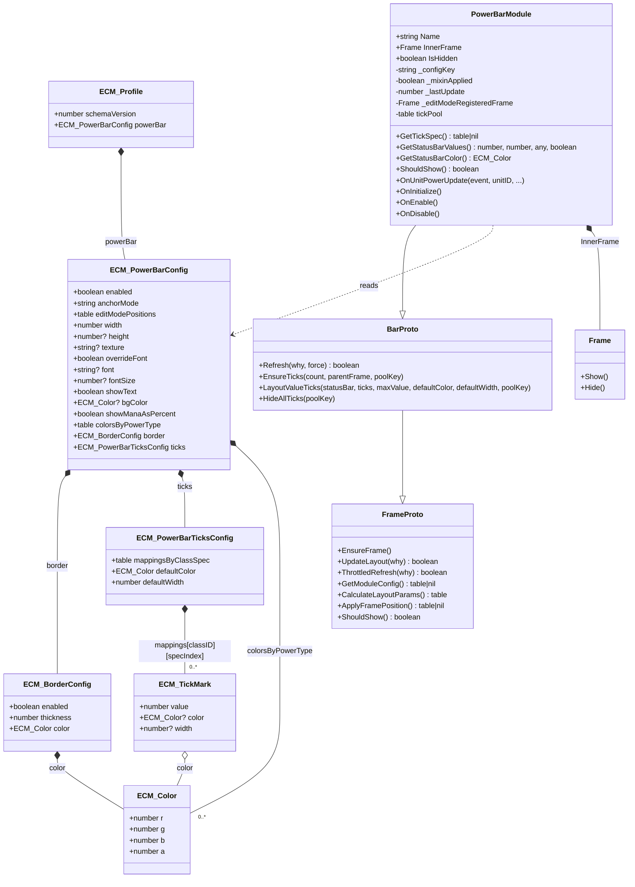

# PowerBar

## 1. Summary table

| Attribute | Value |
|---|---|
| **Module name** | `PowerBar` |
| **Description** | Renders the player's primary power as a single status bar with optional centered text, per-power colors, and spec-specific value tick marks. It also special-cases mana visibility and treats Elemental Shaman as Maelstrom instead of Mana. |
| **Source file** | [`Modules/PowerBar.lua`](../Modules/PowerBar.lua) |
| **Mixin** | `ns.BarMixin.AddBarMixin(self, "PowerBar")` → inherits `BarMixin.BarProto`, which in turn inherits `BarMixin.FrameProto` |
| **Events listened to** | <ul><li><code>UNIT_POWER_UPDATE</code> — listens for player power changes; ignores non-<code>player</code> units and calls <code>ns.Runtime.RequestRefresh(self, event)</code> for a throttled values-only refresh.</li></ul> |
| **Dependencies** | <ul><li><code>ns.Addon</code> — AceAddon module creation / lifecycle.</li><li><code>ns.Constants</code> — power-type, class/spec, and mana-visibility rules.</li><li><code>ns.BarMixin</code> — injects <code>FrameProto</code> + <code>BarProto</code> behavior.</li><li><code>ns.Runtime</code> — frame registration and refresh requests.</li></ul> |
| **Options file(s)** | [`UI/PowerBarOptions.lua`](../UI/PowerBarOptions.lua), [`UI/PowerBarTickMarksOptions.lua`](../UI/PowerBarTickMarksOptions.lua) |
| **Options dependencies** | <ul><li><code>ns.OptionUtil</code> — module toggle handler, shared bar rows, class/spec lookup, color picker, confirm dialog.</li><li><code>ns.Runtime</code> — schedules layout updates for tick edits and option changes.</li><li><code>ns.Constants</code> / <code>ns.L</code> — constants, slider tiers, localized labels.</li><li><code>ns.CloneValue</code> — clones the default tick color for newly added rows.</li><li><code>LibSettingsBuilder</code> — consumes the declarative page / row specs exported by these files.</li></ul> |

## 2. Actor diagram

```mermaid
sequenceDiagram
    autonumber
    participant Game as Game (WoW client)
    participant ACE as ACE (AceAddon / AceDB / LibEvent)
    participant ECM as ECM (addon root)
    participant Runtime as Runtime
    participant PowerBar as PowerBar
    participant Deps as Deps (BarMixin / FrameUtil / EditMode / Constants)

    rect rgb(26,26,46)
    note over Game,Deps: Addon startup / module enable
    Game->>ACE: ADDON_LOADED → AceAddon dispatch
    ACE->>PowerBar: OnInitialize()
    PowerBar->>Deps: BarMixin.AddBarMixin(self, "PowerBar")
    Game->>ACE: PLAYER_LOGIN → AceAddon dispatch
    ACE->>ECM: OnEnable()
    ECM->>Runtime: Enable(addon)
    Runtime->>ACE: EnableModule("PowerBar")
    ACE->>PowerBar: OnEnable()
    PowerBar->>PowerBar: EnsureFrame()
    PowerBar->>Deps: FrameProto:_RegisterEditMode()
    PowerBar->>Runtime: RegisterFrame(self)
    PowerBar->>Game: RegisterEvent("UNIT_POWER_UPDATE")
    end

    rect rgb(26,46,30)
    note over Game,Deps: Shared Runtime layout pulse
    Game->>Runtime: PLAYER_REGEN_* / PLAYER_SPECIALIZATION_CHANGED / ZONE_CHANGED_* / PLAYER_TARGET_CHANGED / etc.
    Runtime->>Runtime: updateFadeAndHiddenStates()
    Runtime->>PowerBar: UpdateLayout(reason)
    PowerBar->>Deps: FrameProto.ApplyFramePosition()
    PowerBar->>PowerBar: ThrottledRefresh("UpdateLayout(...)" )
    PowerBar->>PowerBar: Refresh(reason)
    PowerBar->>Deps: FrameUtil.ApplyFont / LazySet* / tick layout
    end

    rect rgb(46,30,46)
    note over Game,Deps: Module event — data-only refresh
    Game->>PowerBar: UNIT_POWER_UPDATE(unitID)
    PowerBar->>PowerBar: OnUnitPowerUpdate(); ignore unless unitID == "player"
    PowerBar->>Runtime: RequestRefresh(self, "UNIT_POWER_UPDATE")
    Runtime->>PowerBar: ThrottledRefresh(reason)
    PowerBar->>PowerBar: Refresh(reason)
    PowerBar->>PowerBar: GetStatusBarValues() / GetStatusBarColor() / GetTickSpec()
    PowerBar->>Deps: FrameUtil.LazySetStatusBarTexture / Color / value ticks
    end

    rect rgb(30,30,60)
    note over Game,Deps: Profile change
    Game->>ACE: user switches / copies / resets profile
    ACE->>ECM: OnProfileChangedHandler()
    ECM->>Runtime: Enable(addon)
    Runtime->>ACE: EnableModule(PowerBar) when profile.powerBar.enabled is not false
    ECM->>Runtime: ScheduleLayoutUpdate(0, "ProfileChanged")
    Runtime->>PowerBar: UpdateLayout("ProfileChanged")
    PowerBar->>PowerBar: Refresh("ProfileChanged")
    end

    rect rgb(46,40,26)
    note over Game,Deps: Edit Mode interactions
    Game->>Deps: enter / exit / layout switch (LibEditMode)
    Deps->>Runtime: ScheduleLayoutUpdate(0, "EditModeEnter/Exit/Layout")
    Runtime->>PowerBar: UpdateLayout(reason)
    Game->>Deps: drag PowerBar frame
    Deps->>PowerBar: FrameProto:_SaveEditModePosition(...)
    Deps->>Runtime: UpdateLayoutImmediately("EditModeDrag")
    Runtime->>PowerBar: UpdateLayout("EditModeDrag")
    Game->>Deps: adjust width slider
    Deps->>PowerBar: cfg.width = value
    Deps->>Runtime: UpdateLayoutImmediately("EditModeWidth")
    Runtime->>PowerBar: UpdateLayout("EditModeWidth")
    end

    rect rgb(46,26,30)
    note over Game,Deps: Options change
    Game->>Deps: change PowerBar settings / tick editor rows
    Deps->>Runtime: ScheduleLayoutUpdate(0, "OptionsChanged")
    Runtime->>PowerBar: UpdateLayout("OptionsChanged")
    PowerBar->>PowerBar: Refresh("OptionsChanged")
    PowerBar->>Deps: re-read profile.powerBar and reapply ticks, colors, text, and layout
    end
```

## 3. Component interaction diagram (UML)

```mermaid
flowchart LR
    subgraph CALLERS[Inbound callers]
        Game[Game events]
        ACE[ACE lifecycle]
        ECM[ECM addon root]
        Runtime[ns.Runtime]
        EditMode[LibEditMode callbacks]
        Options[PowerBar options pages]
    end

    subgraph MODULE[PowerBar module]
        PowerBar[Modules/PowerBar.lua\nPowerBar]
    end

    subgraph MIXINS[Mixin / frame layer]
        BarMixin[ns.BarMixin.AddBarMixin]
        BarProto[BarMixin.BarProto]
        FrameProto[BarMixin.FrameProto]
        FrameUtil[ns.FrameUtil]
    end

    subgraph CONFIG[Config / constants]
        Profile[profile.powerBar]
        Constants[ns.Constants]
    end

    Game -->|dispatches UNIT_POWER_UPDATE| PowerBar
    ACE -->|calls OnInitialize / OnEnable / OnDisable| PowerBar
    ECM -->|enables module via Runtime.Enable| PowerBar
    Runtime -->|calls UpdateLayout(reason)| PowerBar
    Runtime -->|calls ThrottledRefresh(reason) via RequestRefresh| PowerBar
    EditMode -->|drag / width changes route through Runtime| Runtime
    Options -->|mutate config and schedule OptionsChanged| Runtime

    PowerBar -->|mixes in via| BarMixin
    BarMixin -->|injects| BarProto
    BarProto -->|extends| FrameProto
    FrameProto -->|applies anchors / size / border / bg via| FrameUtil
    BarProto -->|applies text / texture / ticks via| FrameUtil

    PowerBar -->|reads and writes through _configKey = powerBar| Profile
    PowerBar -->|uses power-type and visibility rules from| Constants
    PowerBar -->|registers frame with| Runtime
    PowerBar -->|requests values refresh from| Runtime

    style CALLERS fill:#1a1a2e,stroke:#4cc9f0,color:#e0e0e0
    style MODULE fill:#1a1a2e,stroke:#f7a855,color:#e0e0e0
    style MIXINS fill:#1a1a2e,stroke:#7a84f7,color:#e0e0e0
    style CONFIG fill:#1a1a2e,stroke:#22c55e,color:#e0e0e0
```

## 4. Data model class diagram


