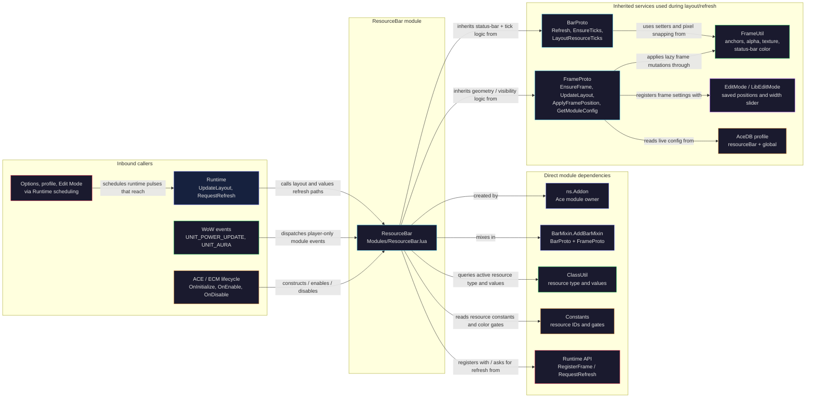
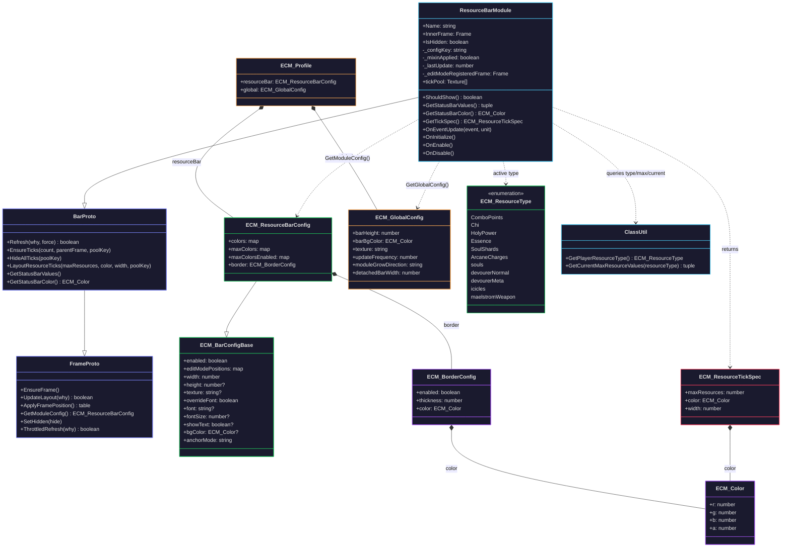

# ResourceBar

`ResourceBar` is the chained status-bar module that renders class/spec-specific secondary resources for Retail WoW. It covers standard combo-style resources like combo points, chi, holy power, essence, and soul shards, plus addon-specific tracked resources such as Vengeance soul fragments, Devourer fragment progress, icicles, and Maelstrom Weapon stacks.

## 1. Summary table

| Attribute | Value |
|---|---|
| **Module name** | `ResourceBar` |
| **Description** | Renders a single status bar for the player's current class/spec resource, switching resource type dynamically through `ClassUtil.GetPlayerResourceType()`. It also draws divider ticks for discrete resources and supports alternate capped colors for selected resource types. |
| **Source file** | [`Modules/ResourceBar.lua`](../Modules/ResourceBar.lua) |
| **Mixin** | `BarMixin.AddBarMixin(self, "ResourceBar")` — inherits `BarProto`, which inherits `FrameProto`. `ResourceBar` overrides `ShouldShow()`, `GetStatusBarValues()`, `GetStatusBarColor()`, and `GetTickSpec()` on top of the shared bar/frame lifecycle. |
| **Events listened to** | <ul><li>`UNIT_AURA` — player-only refresh path for aura-backed resources such as icicles, soul fragments, Devourer progress, and Maelstrom Weapon; secret-value-bearing.</li><li>`UNIT_POWER_UPDATE` — player-only refresh path for standard power resources and any resource changes surfaced through the power event; secret-value-bearing.</li></ul> |
| **Dependencies** | <ul><li>`ns.Addon` — owns the Ace module instance via `:NewModule()`.</li><li>`ns.BarMixin` — supplies `BarProto`/`FrameProto` behavior.</li><li>`ns.Runtime` — frame registration plus values-only refresh dispatch.</li><li>`ns.ClassUtil` — resolves active resource type and `(max, current, safeMax)` values.</li><li>`ns.Constants` — resource-type IDs, tick color, and capped-color feature gates.</li></ul> |
| **Options file(s)** | [`UI/ResourceBarOptions.lua`](../UI/ResourceBarOptions.lua) |
| **Options dependencies** | <ul><li>`ns.OptionUtil` — module enabled handler, disabled delegate, and shared bar row generation.</li><li>`ns.Constants` — resource-type IDs, class colors, and max-color eligibility.</li><li>`ns.L` — localized labels/tooltips.</li><li>`LibSettingsBuilder` row schema — the page spec returned here is consumed by the root options registration in `UI/Options.lua`.</li></ul> |

## 2. Actor diagram

```mermaid
sequenceDiagram
    autonumber
    participant Game as Game (WoW client)
    participant ACE as ACE (AceAddon / AceDB / CallbackHandler)
    participant ECM as ECM (addon root)
    participant Runtime as Runtime
    participant RB as ResourceBar
    participant Deps as Deps (BarMixin, ClassUtil,<br/>FrameUtil, LibEditMode, Constants)

    rect rgb(26,26,46)
    note over Game,Deps: Addon startup and first render
    Game->>ACE: ADDON_LOADED / module load
    ACE->>RB: OnInitialize()
    RB->>Deps: BarMixin.AddBarMixin(self, "ResourceBar")
    Game->>ACE: PLAYER_LOGIN
    ACE->>ECM: OnEnable()
    ECM->>Runtime: Runtime.Enable(addon)
    Runtime->>ACE: EnableModule("ResourceBar")
    ACE->>RB: OnEnable()
    RB->>RB: EnsureFrame()
    RB->>Runtime: RegisterFrame(self)
    RB->>Game: RegisterEvent(UNIT_AURA)
    RB->>Game: RegisterEvent(UNIT_POWER_UPDATE)
    Runtime->>RB: UpdateLayout("ModuleInit")
    RB->>Deps: FrameProto.ApplyFramePosition() / FrameUtil lazy setters
    RB->>RB: ThrottledRefresh("UpdateLayout")
    RB->>Deps: ClassUtil.GetPlayerResourceType()
    RB->>Deps: ClassUtil.GetCurrentMaxResourceValues()
    RB->>Deps: FrameUtil texture/color updates
    RB->>RB: GetTickSpec() -> EnsureTicks() -> LayoutResourceTicks()
    end

    rect rgb(26,46,30)
    note over Game,Deps: Shared runtime layout pulse reaches ResourceBar
    Game->>Runtime: layout event (mount/combat/zone/spec/target/edit-preview state)
    Runtime->>Runtime: updateFadeAndHiddenStates()
    Runtime->>RB: UpdateLayout(reason)
    RB->>Deps: FrameProto.ApplyFramePosition() / background / border
    RB->>RB: ThrottledRefresh(reason)
    RB->>Deps: GetStatusBarValues() / GetStatusBarColor() / GetTickSpec()
    RB->>Deps: EnsureTicks() / LayoutResourceTicks()
    end

    rect rgb(46,30,46)
    note over Game,Deps: Module data event — UNIT_POWER_UPDATE
    Game->>RB: UNIT_POWER_UPDATE(unit = "player", ...)
    RB->>RB: OnEventUpdate(event, unit)
    RB->>Runtime: RequestRefresh(self, "UNIT_POWER_UPDATE")
    Runtime->>RB: ThrottledRefresh("UNIT_POWER_UPDATE")
    RB->>Deps: ClassUtil.GetPlayerResourceType()
    RB->>Deps: ClassUtil.GetCurrentMaxResourceValues()<br/>(secret-bearing power path)
    RB->>RB: GetStatusBarColor() / GetTickSpec()
    end

    rect rgb(30,30,60)
    note over Game,Deps: Module data event — UNIT_AURA
    Game->>RB: UNIT_AURA(unit = "player", ...)
    RB->>RB: OnEventUpdate(event, unit)
    RB->>Runtime: RequestRefresh(self, "UNIT_AURA")
    Runtime->>RB: ThrottledRefresh("UNIT_AURA")
    RB->>Deps: ClassUtil.GetPlayerResourceType()
    RB->>Deps: ClassUtil.GetCurrentMaxResourceValues()<br/>(secret-bearing aura path)
    RB->>RB: GetStatusBarColor() / GetTickSpec()
    end

    rect rgb(46,40,26)
    note over Game,Deps: Profile change
    Game->>ACE: profile switched / copied / reset
    ACE->>ECM: OnProfileChangedHandler()
    ECM->>Runtime: Runtime.Enable(addon)
    ECM->>Runtime: ScheduleLayoutUpdate(0, "ProfileChanged")
    Runtime->>RB: UpdateLayout("ProfileChanged")
    RB->>Deps: Re-read live config from AceDB
    RB->>RB: Refresh with new width/colors/tick behavior
    end

    rect rgb(46,26,30)
    note over Game,Deps: Options change
    Game->>Deps: Settings row changed in ResourceBar options
    Deps->>Runtime: ScheduleLayoutUpdate(0, "OptionsChanged")
    Runtime->>RB: UpdateLayout("OptionsChanged")
    RB->>Deps: GetModuleConfig() / GetGlobalConfig()
    RB->>RB: Refresh with updated appearance/config
    end

    rect rgb(26,40,46)
    note over Game,Deps: Edit Mode enter / exit
    Game->>Deps: LibEditMode enter or exit callback
    Deps->>Runtime: ScheduleLayoutUpdate(0, "EditModeEnter" / "EditModeExit")
    Runtime->>RB: UpdateLayout(reason)
    RB->>Deps: FrameProto.ApplyFramePosition()
    RB->>RB: Refresh while force-visible
    end

    rect rgb(36,26,46)
    note over Game,Deps: Edit Mode drag / width slider
    Game->>Deps: drag frame or change width slider
    Deps->>Runtime: UpdateLayoutImmediately("EditModeDrag" / "EditModeWidth")
    Runtime->>RB: UpdateLayout(reason)
    RB->>Deps: ApplyFramePosition() with saved Edit Mode position
    RB->>RB: Refresh and recompute ticks against new width
    end
```

## 3. Component interaction diagram (UML)

## 4. Data model class diagram

`Defaults.lua` seeds `resourceBar` with `enabled = true`, `showText = false`, `anchorMode = "chain"`, `width = 300`, empty `editModePositions`, a disabled border block, resource color tables, and max-color tables for the resource types gated in `Constants.lua`.

