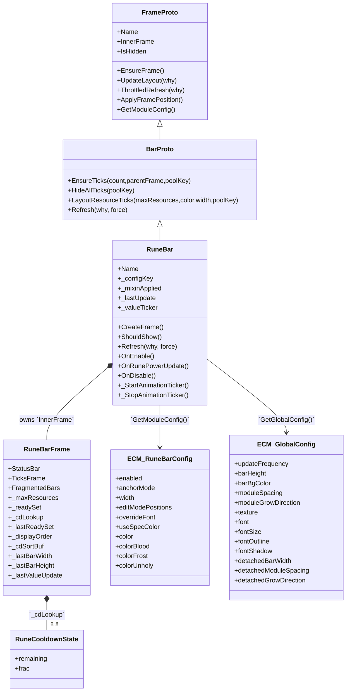

# RuneBar

`RuneBar` is ECM's Death Knight rune display module. It is the third chained bar module after `PowerBar` and `ResourceBar`, and it participates in the shared `Runtime.lua` layout, fade, profile, options, and Edit Mode flows while owning its rune-specific fragment rendering and cooldown animation ticker.

## Summary

| Item | Details |
|---|---|
| **Module name** | `RuneBar` |
| **Description** | Displays the six Death Knight runes as a fragmented bar. Ready runes are packed first, cooling runes follow in remaining-time order, and rune cooldown fill animates on a lightweight ticker while any rune is recharging. |
| **Source file** | [`Modules/RuneBar.lua`](../Modules/RuneBar.lua) |
| **Mixin** | `BarMixin.AddBarMixin(self, "RuneBar")` → `BarMixin.BarProto` layered over `BarMixin.FrameProto`; `RuneBar` overrides `CreateFrame()`, `ShouldShow()`, and `Refresh()`. |
| **Events listened to** | - `RUNE_POWER_UPDATE` — the only WoW event registered directly by `RuneBar`; starts the value ticker and requests a throttled refresh.<br/>- Shared layout pulses come from [`Runtime.lua`](../Runtime.lua), which calls `RuneBar:UpdateLayout(...)` on global lifecycle events rather than having `RuneBar` register them itself. |
| **Dependencies** | - [`BarMixin.lua`](../BarMixin.lua) — shared frame/bar mixins, tick pools, Edit Mode frame registration.<br/>- [`Runtime.lua`](../Runtime.lua) — module registration, shared layout execution, shared fade/hidden state, refresh requests.<br/>- [`FrameUtil.lua`](../FrameUtil.lua) — texture lookup, pixel snapping, lazy frame setters used indirectly through layout helpers and directly for fragment sizing.<br/>- [`Constants.lua`](../Constants.lua) — `RUNEBAR_MAX_RUNES`, `RUNEBAR_CD_DIM_FACTOR`, Death Knight spec constants, chain order, shared timing defaults.<br/>- [`ECM.lua`](../ECM.lua) — `ns.IsDeathKnight()`, `ns.GetGlobalConfig()`, addon module lifecycle.<br/>- WoW APIs — `GetRuneCooldown()`, `GetSpecialization()`, `GetTime()`, `C_Timer.NewTicker()`, `CreateFrame()`. |
| **Options file(s)** | [`UI/RuneBarOptions.lua`](../UI/RuneBarOptions.lua) |
| **Options dependencies** | - `ns.OptionUtil` — standard bar rows, module enable handler, disabled delegates.<br/>- `ns.Addon.db.profile.runeBar` — live config reads/writes for checkbox and color rows.<br/>- `ns.L` — localized labels/tooltips.<br/>- `ns.IsDeathKnight()` — DK-only gating for warning text and page disabled state.<br/>- [`UI/Options.lua`](../UI/Options.lua) / `LibSettingsBuilder-1.0` — consumes `ns.RuneBarOptions` as one section in the root settings tree. |

## Actor diagram

```mermaid
sequenceDiagram
    autonumber
    participant Game as Game
    participant ACE as ACE / AceAddon / AceDB
    participant ECM as ECM
    participant Runtime as Runtime
    participant RuneBar as RuneBar
    participant Mixins as BarMixin / FrameProto
    participant UI as Options / Edit Mode

    rect rgb(26,26,46)
    note over Game,UI: Startup / initialization
    Game->>ACE: ADDON_LOADED / PLAYER_LOGIN
    ACE->>RuneBar: OnInitialize()
    RuneBar->>Mixins: AddBarMixin(self, "RuneBar")
    ACE->>ECM: OnEnable()
    ECM->>Runtime: Enable(addon)
    Runtime->>RuneBar: EnableModule("RuneBar")
    RuneBar->>RuneBar: OnEnable()
    RuneBar->>Mixins: EnsureFrame()
    RuneBar->>Runtime: RegisterFrame(self)
    RuneBar->>Game: RegisterEvent("RUNE_POWER_UPDATE")
    Game->>Runtime: Shared layout event
    Runtime->>RuneBar: UpdateLayout(reason)
    RuneBar->>Mixins: ApplyFramePosition() / ThrottledRefresh()
    RuneBar->>RuneBar: Refresh()<br/>ensure fragments + ticks<br/>updateFragmentedRuneDisplay()
    end

    rect rgb(26,46,30)
    note over Game,UI: Rune event entry point
    Game->>RuneBar: RUNE_POWER_UPDATE
    RuneBar->>RuneBar: _StartAnimationTicker()
    RuneBar->>Runtime: RequestRefresh("RuneBar:RUNE_POWER_UPDATE")
    Runtime->>RuneBar: ThrottledRefresh(...)
    RuneBar->>RuneBar: Refresh()
    end

    rect rgb(46,30,46)
    note over Game,UI: Rune cooldown animation ticker
    Game->>RuneBar: C_Timer.NewTicker(updateFrequency)
    RuneBar->>RuneBar: updateRuneValues(self, InnerFrame)
    alt ready/cooldown membership changed
        RuneBar->>Runtime: RequestRefresh("RuneBar:RuneStateChange")
        Runtime->>RuneBar: ThrottledRefresh(...)
        RuneBar->>RuneBar: Refresh()<br/>reorder + reposition fragments
    else only fill values changed
        RuneBar->>RuneBar: applyRuneFragmentVisual() per fragment
    end
    alt all runes ready
        RuneBar->>RuneBar: _StopAnimationTicker()
    end
    end

    rect rgb(30,30,60)
    note over Game,UI: Runtime layout pulses
    Game->>Runtime: Mount / vehicle / combat / zone / spec / target / resting / CVAR events
    Runtime->>Runtime: updateFadeAndHiddenStates()
    Runtime->>RuneBar: UpdateLayout(reason)
    RuneBar->>Mixins: ApplyFramePosition()
    RuneBar->>RuneBar: Refresh()<br/>LayoutResourceTicks(6)<br/>start ticker if any rune cooling down
    end

    rect rgb(46,40,26)
    note over Game,UI: Profile change
    Game->>ACE: profile changed / copied / reset
    ACE->>ECM: OnProfileChangedHandler()
    ECM->>Runtime: Enable(addon)
    ECM->>Runtime: ScheduleLayoutUpdate(0, "ProfileChanged")
    Runtime->>RuneBar: UpdateLayout("ProfileChanged")
    end

    rect rgb(46,26,30)
    note over Game,UI: Options change
    Game->>UI: User changes RuneBar setting
    UI->>Runtime: ScheduleLayoutUpdate(0, "OptionsChanged")
    Runtime->>RuneBar: UpdateLayout("OptionsChanged")
    end

    rect rgb(26,40,46)
    note over Game,UI: Edit Mode
    Game->>UI: Edit Mode enter / exit / layout switch
    UI->>Runtime: ScheduleLayoutUpdate(0, "EditModeEnter/Exit/Layout")
    Runtime->>RuneBar: UpdateLayout(...)
    Game->>UI: Drag RuneBar frame or adjust width
    UI->>Runtime: UpdateLayoutImmediately("EditModeDrag" / "EditModeWidth")
    Runtime->>RuneBar: UpdateLayout(...)
    end
```



## Component interaction diagram

```mermaid
flowchart TD
    Game["Game / WoW APIs"] -->|`RUNE_POWER_UPDATE`| RuneBar
    ACE["AceAddon / AceDB"] -->|`OnInitialize` / `OnEnable` / profile callbacks| RuneBar
    ACE -->|profile change re-enable path| Runtime
    UI["Options UI / LibSettingsBuilder / LibEditMode"] -->|config writes / drag-resize callbacks| Runtime
    Runtime -->|`EnableModule`| RuneBar
    Runtime -->|`RegisterFrame` stores module| RuneBar
    Runtime -->|`UpdateLayout(reason)`| RuneBar
    Runtime -->|`RequestRefresh(...)` -> `ThrottledRefresh(...)`| RuneBar
    RuneBar -->|`RequestRefresh`| Runtime
    RuneBar -->|`RegisterFrame` / `UnregisterFrame`| Runtime

    subgraph MIXINS["Shared mixins"]
        FrameProto["`BarMixin.FrameProto`
positioning / visibility / Edit Mode"]
        BarProto["`BarMixin.BarProto`
StatusBar / ticks / throttled refresh"]
        FrameProto --> BarProto
    end

    subgraph DATA["Shared addon state"]
        ECM["`ECM.lua`
`ns.IsDeathKnight()`
`ns.GetGlobalConfig()`"]
        Constants["`Constants.lua`
chain order / rune constants"]
        Defaults["`Defaults.lua`
`profile.runeBar` defaults"]
    end

    subgraph UTIL["Utility helpers"]
        FrameUtil["`FrameUtil.lua`
`GetTexture()`
`PixelSnap()`
lazy setters"]
        OptionUtil["`OptionUtil`
shared option rows / delegates"]
    end

    subgraph OPTIONS["Settings pages"]
        RuneBarOptions["`UI/RuneBarOptions.lua`
page spec"]
        RootOptions["`UI/Options.lua`
root registration"]
        RuneBarOptions -->|section export| RootOptions
    end

    subgraph RUNTIME_STATE["RuneBar-owned runtime state"]
        Frame["InnerFrame
StatusBar + TicksFrame + FragmentedBars"]
        Ticker["`_valueTicker`
active while any rune is cooling down"]
        Ready["`_readySet` / `_lastReadySet`
ready membership cache"]
        Cooldowns["`_cdLookup`
remaining + frac by rune"]
        Order["`_displayOrder` / `_cdSortBuf`
layout order cache"]
    end

    RuneBar -->|mixin methods| BarProto
    RuneBar -->|module/global config lookup| ECM
    RuneBar -->|rune count, dim factor, spec keys| Constants
    RuneBar -->|default persisted config| Defaults
    RuneBar -->|frame creation / texture / pixel snapping| FrameUtil
    RuneBar -->|event + timer APIs| Game
    RuneBar -->|options read/write target| RuneBarOptions
    RuneBar --> Frame
    RuneBar --> Ticker
    Frame --> Ready
    Frame --> Cooldowns
    Frame --> Order

    style MIXINS fill:#1a1a2e,stroke:#7a84f7,color:#e0e0e0
    style DATA fill:#1a1a2e,stroke:#22c55e,color:#e0e0e0
    style UTIL fill:#1a1a2e,stroke:#f7a855,color:#e0e0e0
    style OPTIONS fill:#1a1a2e,stroke:#f43f5e,color:#e0e0e0
    style RUNTIME_STATE fill:#1a1a2e,stroke:#4cc9f0,color:#e0e0e0
```

## Data model class diagram



## Notes

- `RuneBar` does **not** call into [`BarStyle.lua`](../BarStyle.lua); that shared styling namespace is for `BuffBars` / `ExternalBars`. RuneBar styling is bar-native through `BarMixin` + `FrameUtil`.
- `ClassUtil.lua` and `ColorUtil.lua` do not participate directly in RuneBar runtime logic; RuneBar uses Death Knight class gating from [`ECM.lua`](../ECM.lua) and its own rune/spec color selection.
- Config in the class diagram is verified against [`Defaults.lua`](../Defaults.lua). Registered events are verified against explicit `RegisterEvent(...)` calls in [`Modules/RuneBar.lua`](../Modules/RuneBar.lua) and shared runtime registration in [`Runtime.lua`](../Runtime.lua).
