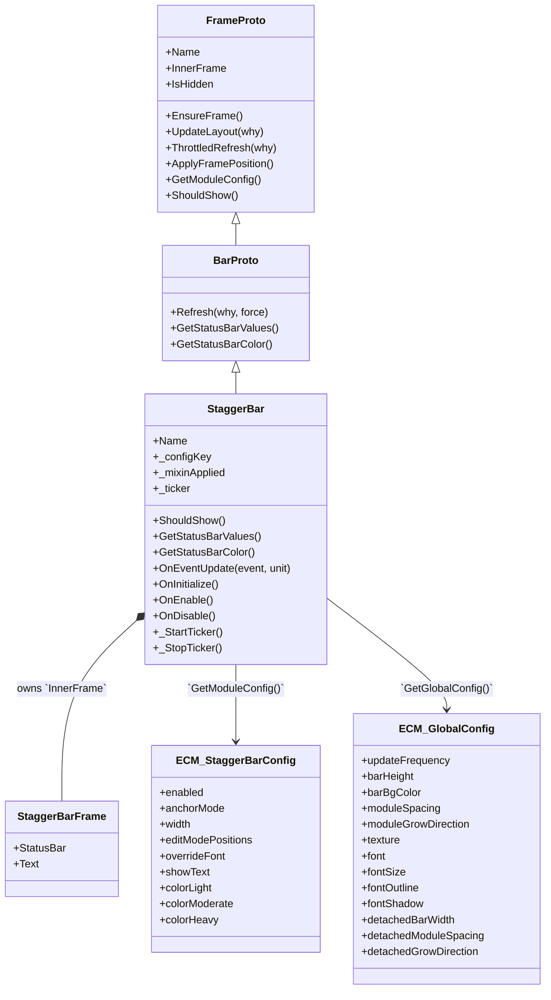

# StaggerBar

`StaggerBar` is ECM's Brewmaster Monk stagger display module. It is the fourth chained bar module, after `PowerBar`, `ResourceBar`, and `RuneBar`, and it participates in the shared `Runtime.lua` layout, fade, profile, options, and Edit Mode flows while owning its stagger-specific value readout, level coloring, and drain animation ticker.

## Summary

| Item | Details |
|---|---|
| **Module name** | `StaggerBar` |
| **Description** | Displays the Brewmaster Monk's Stagger pool as a continuous StatusBar filled to `UnitStagger("player") / UnitHealthMax("player")`, labelled with a whole-number percentage. The fill color follows the active stagger level debuff (heavy over moderate over light), and the bar polls on a lightweight ticker so the pool visibly drains between aura events. |
| **Source file** | [`Modules/StaggerBar.lua`](../Modules/StaggerBar.lua) |
| **Mixin** | `BarMixin.AddBarMixin(self, "StaggerBar")` → `BarMixin.BarProto` layered over `BarMixin.FrameProto`; `StaggerBar` overrides `ShouldShow()`, `GetStatusBarValues()`, and `GetStatusBarColor()` and relies on the shared `BarProto.Refresh()`. |
| **Events listened to** | - `UNIT_AURA` — the only WoW event registered directly by `StaggerBar`; on a `player` update it starts the drain ticker and requests a refresh.<br/>- Shared layout pulses come from [`Runtime.lua`](../Runtime.lua), which calls `StaggerBar:UpdateLayout(...)` on global lifecycle events (including `PLAYER_SPECIALIZATION_CHANGED`) rather than having `StaggerBar` register them itself. |
| **Dependencies** | - [`BarMixin.lua`](../BarMixin.lua) — shared frame/bar mixins, StatusBar rendering, Edit Mode frame registration.<br/>- [`Runtime.lua`](../Runtime.lua) — module registration, shared layout execution, shared fade/hidden state, refresh requests.<br/>- [`Constants.lua`](../Constants.lua) — `SPELLID_STAGGER_LIGHT/MODERATE/HEAVY`, `DEFAULT_REFRESH_FREQUENCY`, `COLOR_WHITE`, chain/load order.<br/>- [`ClassUtil.lua`](../ClassUtil.lua) — `ns.ClassUtil.IsBrewmasterMonk()` for Brewmaster spec gating.<br/>- [`ECM.lua`](../ECM.lua) — `ns.GetGlobalConfig()`, addon module lifecycle.<br/>- WoW APIs — `UnitStagger()`, `UnitHealthMax()`, `UnitClass()`, `C_UnitAuras.GetPlayerAuraBySpellID()`, `C_Timer.NewTicker()`. |
| **Options file(s)** | [`UI/StaggerBarOptions.lua`](../UI/StaggerBarOptions.lua) |
| **Options dependencies** | - `ns.OptionUtil` — standard bar rows, module enable handler, disabled delegates.<br/>- `ns.Addon.db.profile.staggerBar` — live config reads/writes for the checkbox and color rows.<br/>- `ns.L` — localized labels/tooltips.<br/>- `ns.ClassUtil.IsBrewmasterMonk()` — Brewmaster-only gating for warning text and page disabled state.<br/>- [`UI/Options.lua`](../UI/Options.lua) / `LibSettingsBuilder-1.0` — consumes `ns.StaggerBarOptions` as one section in the root settings tree. |

## Actor diagram

```mermaid
sequenceDiagram
    autonumber
    participant Game as Game
    participant ACE as ACE / AceAddon / AceDB
    participant ECM as ECM
    participant Runtime as Runtime
    participant StaggerBar as StaggerBar
    participant Mixins as BarMixin / FrameProto
    participant UI as Options / Edit Mode

    rect rgb(26,26,46)
    note over Game,UI: Startup / initialization
    Game->>ACE: ADDON_LOADED / PLAYER_LOGIN
    ACE->>StaggerBar: OnInitialize()
    StaggerBar->>Mixins: AddBarMixin(self, "StaggerBar")
    ACE->>ECM: OnEnable()
    ECM->>Runtime: Enable(addon)
    Runtime->>StaggerBar: EnableModule("StaggerBar")
    StaggerBar->>StaggerBar: OnEnable()<br/>gate on MONK class
    StaggerBar->>Mixins: EnsureFrame()
    StaggerBar->>Runtime: RegisterFrame(self)
    StaggerBar->>Game: RegisterEvent("UNIT_AURA")
    Game->>Runtime: Shared layout event
    Runtime->>StaggerBar: UpdateLayout(reason)
    StaggerBar->>Mixins: ApplyFramePosition() / Refresh()
    StaggerBar->>StaggerBar: ShouldShow()<br/>Brewmaster spec gate
    end

    rect rgb(26,46,30)
    note over Game,UI: Aura event entry point
    Game->>StaggerBar: UNIT_AURA (player)
    StaggerBar->>StaggerBar: _StartTicker()
    StaggerBar->>Runtime: RequestRefresh("StaggerBar:OnEventUpdate")
    Runtime->>StaggerBar: ThrottledRefresh(...)
    StaggerBar->>Mixins: Refresh()<br/>GetStatusBarValues() + GetStatusBarColor()
    end

    rect rgb(46,30,46)
    note over Game,UI: Stagger drain ticker
    Game->>StaggerBar: C_Timer.NewTicker(DEFAULT_REFRESH_FREQUENCY)
    StaggerBar->>StaggerBar: ThrottledRefresh("StaggerBar:Ticker")
    alt any stagger aura still present
        StaggerBar->>Mixins: Refresh()<br/>redraw drained value
    else pool cleared
        StaggerBar->>StaggerBar: _StopTicker()<br/>final render at 0
    end
    end

    rect rgb(30,30,60)
    note over Game,UI: Runtime layout pulses
    Game->>Runtime: Mount / combat / zone / spec / resting / CVAR events
    Runtime->>Runtime: updateFadeAndHiddenStates()
    Runtime->>StaggerBar: UpdateLayout(reason)
    StaggerBar->>Mixins: ApplyFramePosition()
    StaggerBar->>StaggerBar: ShouldShow()<br/>hide outside Brewmaster spec
    end

    rect rgb(46,40,26)
    note over Game,UI: Profile change
    Game->>ACE: profile changed / copied / reset
    ACE->>ECM: OnProfileChangedHandler()
    ECM->>Runtime: Enable(addon)
    ECM->>Runtime: ScheduleLayoutUpdate(0, "ProfileChanged")
    Runtime->>StaggerBar: UpdateLayout("ProfileChanged")
    end

    rect rgb(46,26,30)
    note over Game,UI: Options change
    Game->>UI: User changes StaggerBar setting
    UI->>Runtime: ScheduleLayoutUpdate(0, "OptionsChanged")
    Runtime->>StaggerBar: UpdateLayout("OptionsChanged")
    end

    rect rgb(26,40,46)
    note over Game,UI: Edit Mode
    Game->>UI: Edit Mode enter / exit / layout switch
    UI->>Runtime: ScheduleLayoutUpdate(0, "EditModeEnter/Exit/Layout")
    Runtime->>StaggerBar: UpdateLayout(...)
    Game->>UI: Drag StaggerBar frame or adjust width
    UI->>Runtime: UpdateLayoutImmediately("EditModeDrag" / "EditModeWidth")
    Runtime->>StaggerBar: UpdateLayout(...)
    end
```



## Component interaction diagram

```mermaid
flowchart TD
    Game["Game / WoW APIs"] -->|`UNIT_AURA`| StaggerBar
    ACE["AceAddon / AceDB"] -->|`OnInitialize` / `OnEnable` / profile callbacks| StaggerBar
    ACE -->|profile change re-enable path| Runtime
    UI["Options UI / LibSettingsBuilder / LibEditMode"] -->|config writes / drag-resize callbacks| Runtime
    Runtime -->|`EnableModule`| StaggerBar
    Runtime -->|`RegisterFrame` stores module| StaggerBar
    Runtime -->|`UpdateLayout(reason)`| StaggerBar
    Runtime -->|`RequestRefresh(...)` -> `ThrottledRefresh(...)`| StaggerBar
    StaggerBar -->|`RequestRefresh`| Runtime
    StaggerBar -->|`RegisterFrame` / `UnregisterFrame`| Runtime

    subgraph MIXINS["Shared mixins"]
        FrameProto["`BarMixin.FrameProto`
positioning / visibility / Edit Mode"]
        BarProto["`BarMixin.BarProto`
StatusBar / text / throttled refresh"]
        FrameProto --> BarProto
    end

    subgraph DATA["Shared addon state"]
        ECM["`ECM.lua`
`ns.GetGlobalConfig()`"]
        ClassUtil["`ClassUtil.lua`
`ns.ClassUtil.IsBrewmasterMonk()`"]
        Constants["`Constants.lua`
chain order / stagger spell IDs"]
        Defaults["`Defaults.lua`
`profile.staggerBar` defaults"]
    end

    subgraph UTIL["Utility helpers"]
        OptionUtil["`OptionUtil`
shared option rows / delegates"]
    end

    subgraph OPTIONS["Settings pages"]
        StaggerBarOptions["`UI/StaggerBarOptions.lua`
page spec"]
        RootOptions["`UI/Options.lua`
root registration"]
        StaggerBarOptions -->|section export| RootOptions
    end

    subgraph RUNTIME_STATE["StaggerBar-owned runtime state"]
        Frame["InnerFrame
StatusBar + text"]
        Ticker["`_ticker`
active while any stagger aura is present"]
    end

    StaggerBar -->|mixin methods| BarProto
    StaggerBar -->|module/global config lookup| ECM
    StaggerBar -->|Brewmaster spec gating| ClassUtil
    StaggerBar -->|stagger spell IDs, refresh frequency| Constants
    StaggerBar -->|default persisted config| Defaults
    StaggerBar -->|aura + timer APIs| Game
    StaggerBar -->|options read/write target| StaggerBarOptions
    StaggerBar --> Frame
    StaggerBar --> Ticker

    style MIXINS fill:#1a1a2e,stroke:#7a84f7,color:#e0e0e0
    style DATA fill:#1a1a2e,stroke:#22c55e,color:#e0e0e0
    style UTIL fill:#1a1a2e,stroke:#f7a855,color:#e0e0e0
    style OPTIONS fill:#1a1a2e,stroke:#f43f5e,color:#e0e0e0
    style RUNTIME_STATE fill:#1a1a2e,stroke:#4cc9f0,color:#e0e0e0
```

## Data model class diagram



## Notes

- `OnEnable` gates on the **MONK class** (which never changes at runtime) so the frame is only built for monks. The **Brewmaster spec** gate lives in `ShouldShow()` via `ns.ClassUtil.IsBrewmasterMonk()`, so switching specs is handled by the existing `PLAYER_SPECIALIZATION_CHANGED` layout pulse rather than a module-owned event.
- `UnitStagger` and `UnitHealthMax` are **not** secret values (unlike `UnitPower*`), so `GetStatusBarValues()` computes the fill fraction and percentage directly. `GetStatusBarColor()` reads which stagger debuff is active via `C_UnitAuras.GetPlayerAuraBySpellID()`.
- The drain ticker refreshes on `DEFAULT_REFRESH_FREQUENCY` and stops once no stagger aura remains. It refreshes **before** the emptiness check so the pool always renders a final frame at 0. This is the same self-stopping ticker pattern used by [`RuneBar`](RuneBar.md); ECM never uses `OnUpdate`.
- `StaggerBar` does **not** call into [`BarStyle.lua`](../BarStyle.lua); styling is bar-native through `BarMixin`.
- Config in the class diagram is verified against [`Defaults.lua`](../Defaults.lua). The registered event is verified against the explicit `RegisterEvent("UNIT_AURA", ...)` call in [`Modules/StaggerBar.lua`](../Modules/StaggerBar.lua) and shared runtime registration in [`Runtime.lua`](../Runtime.lua).
